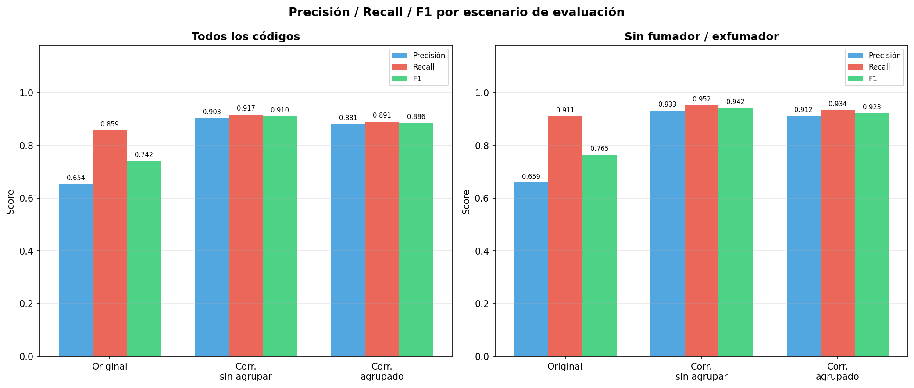
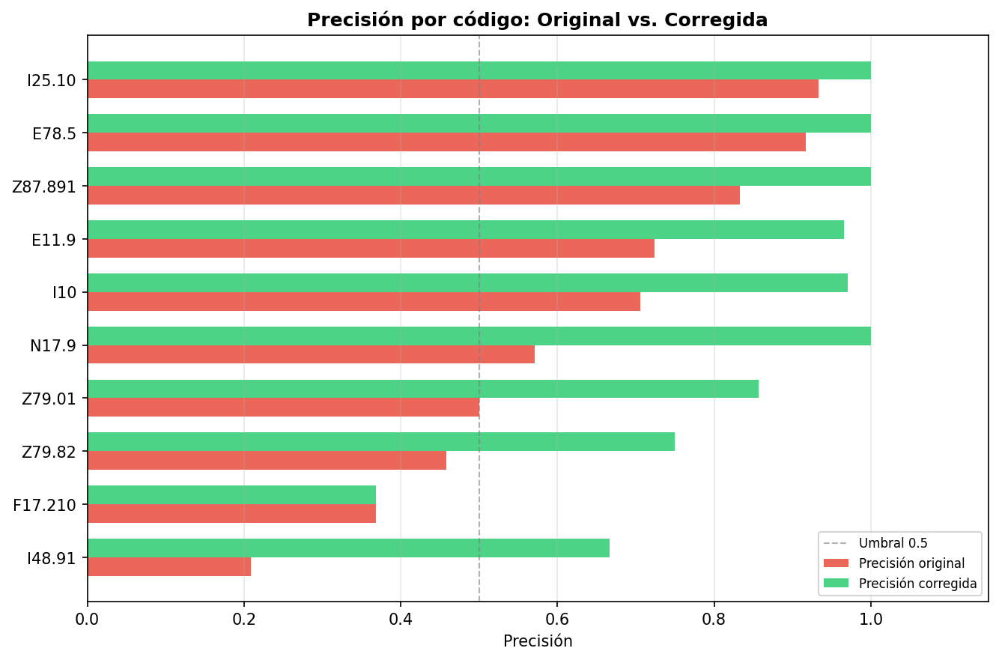
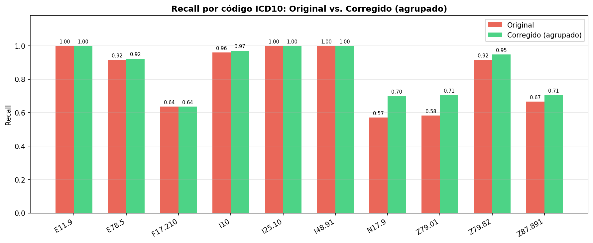
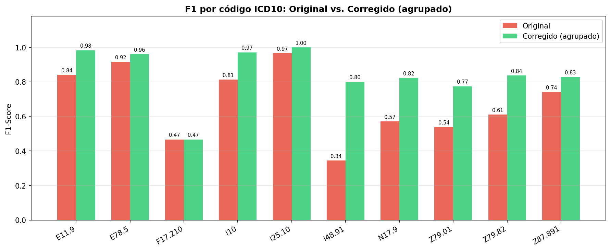
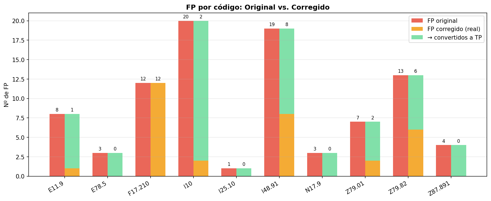
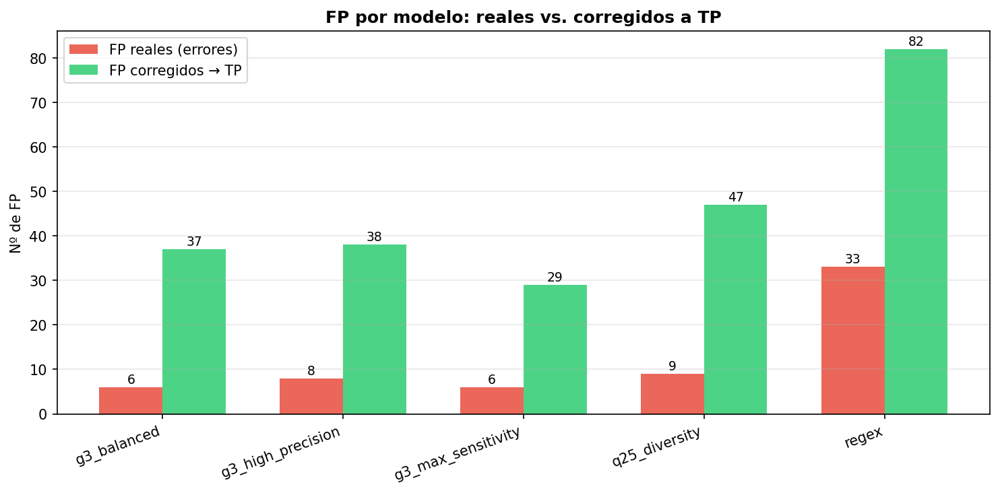
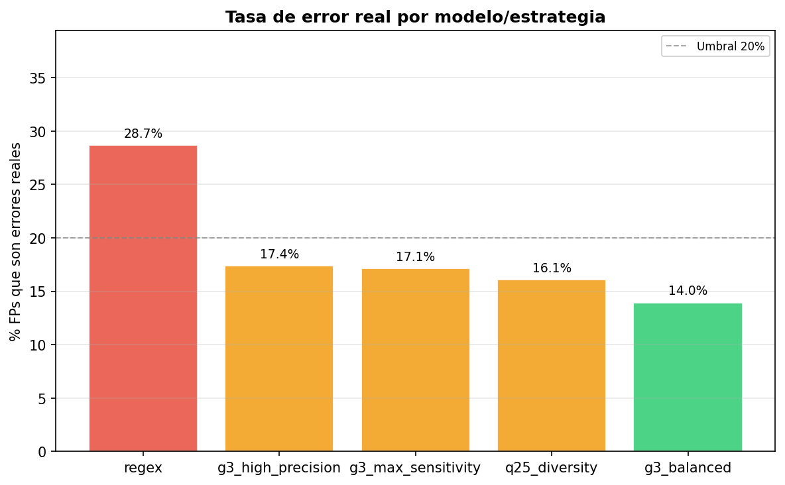
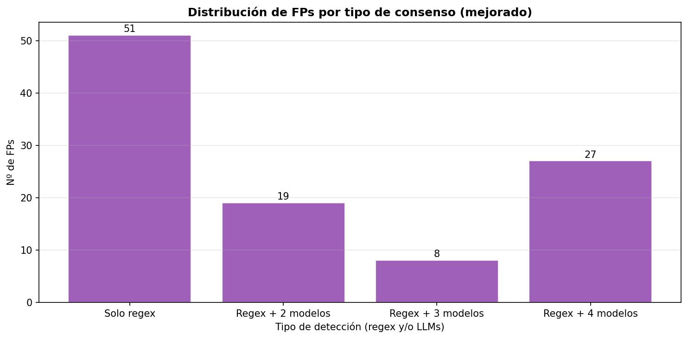
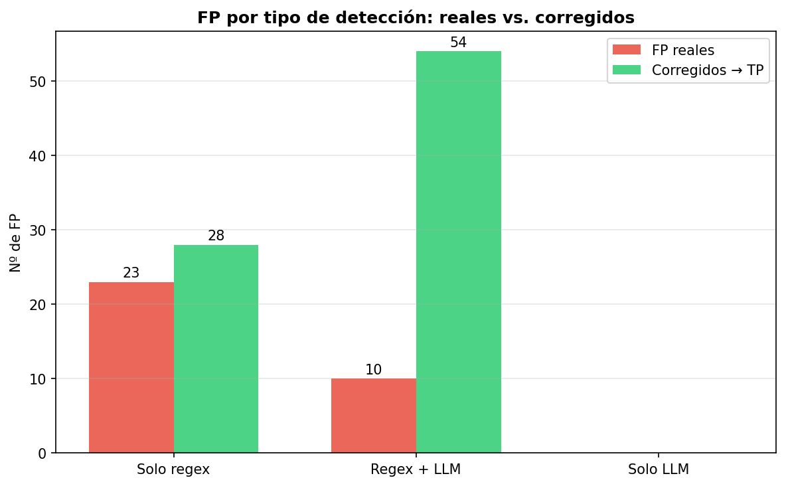
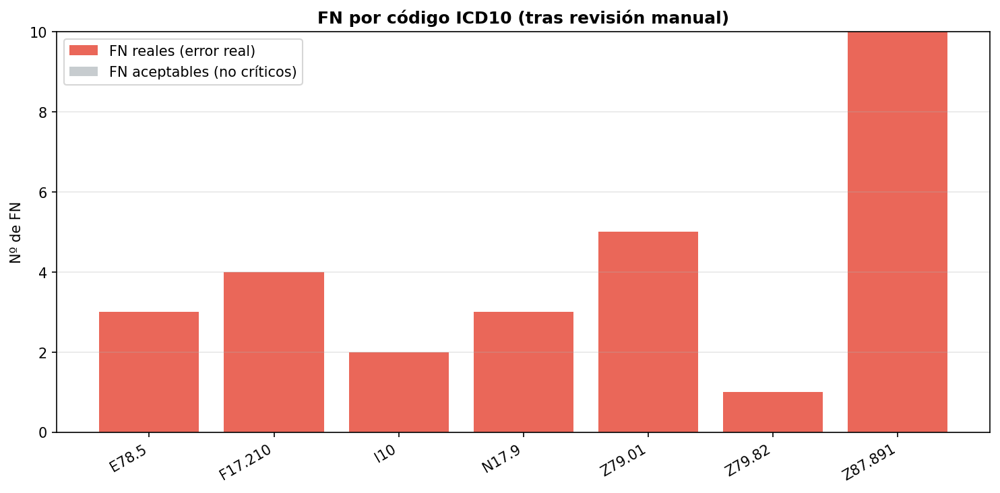

# Documentación Completa del Pipeline NER Multi-Estrategia

## Tabla de Contenidos
1. [Visión General](#visión-general)
2. [Flujo de Procesamiento Detallado](#flujo-de-procesamiento-detallado)
3. [Componentes Principales](#componentes-principales)
4. [Estrategias de Detección](#estrategias-de-detección)
5. [Sistema de Reintentos Inteligente](#sistema-de-reintentos-inteligente)
6. [Matching y Normalización de Entidades](#matching-y-normalización-de-entidades)
7. [Sistema de Scoring y Confianza](#sistema-de-scoring-y-confianza)
8. [Optimizaciones de Rendimiento](#optimizaciones-de-rendimiento)
9. [Gestión de Memoria y Archivos](#gestión-de-memoria-y-archivos)
10. [Formato de Salida](#formato-de-salida)
11. [Configuración de Ollama](#configuración-de-ollama)
12. [Evaluación y Métricas](#evaluación-y-métricas)
13. [Métricas de Performance](#métricas-de-performance)

---

## Visión General

El sistema NER (Named Entity Recognition) Multi-Estrategia es una pipeline modular diseñada para detectar entidades médicas en textos clínicos, combinando múltiples estrategias de detección: una baseline de regex y cuatro modelos LLM ejecutados en paralelo. No está orientado a la detección general de entidades, sino a una detección dirigida y focalizada. 

### Características Principales
- **Multi-estrategia**: Combina regex + 4 LLMs en paralelo
- **Multilenguaje avanzado**: 
  - Soporte real para inglés y español
  - System prompts adaptados por idioma
  - Stop words específicas en fuzzy matching
  - Normalización de acentos optimizada para español
- **Eficiencia de memoria**: Uso de archivos temporales para grandes volúmenes
- **Sistema de confianza avanzado**: Scoring basado en múltiples factores
- **Sistema de reintentos inteligente**: 3 fases de fallback para maximizar recall
- **Procesamiento incremental**: Guarda resultados tras cada documento
- **Reinicio automático**: Detecta documentos ya procesados, evitando repetir trabajo ya completado

---

## Flujo de Procesamiento Detallado

### 1. Inicialización del Sistema

#### 1.1 Punto de Entrada

El objetivo de esta fase es preparar el entorno y las variables globales para el pipeline:

1. Parseo de argumentos CLI. ⚠️ Importante! Durante toda la ejecución se ha utilizado el comando:
```bash
python -m ner_app.main  --input_jsonl datasets/<input_file>.jsonl   --out_pred <output_file>.jsonl   --language <es|en>   --limit <num_docs>
```

2. Validación de argumentos y existencia de ficheros.
3. Configuración del logging mediante `TeeWriter` (salida a consola y archivo con timestamps).
4. Carga de la configuración de estrategias: 
    * Si no se pasa `--model` ni `--strategies`, se utilizan las cuatro estrategias definidas en `ner_app/config/strategies.py`
    * Si se pasa `--model`, se crea una estrategia dinámica con parámetros por defecto.
5. Actualización de los umbrales de confianza desde `ner_app/config/thresholds.py` o desde el valor `--confidence_threshold` en la CLI.

Estos pasos no realizan todavía procesamiento sobre los documentos: su objetivo es dejar listas las variables `strategies`, `confidence_thresholds` y las rutas de entrada/salida para el bucle principal.

Dado que no se hacen especificaciones en el CLI parser, el sistema utiliza los valores predeterminados configurados en la pipeline interna, según las estrategias y parámetros definidos en el código.

Pseudocódigo (ubicación: `ner_app/main.py`):

```python
# main.py
args = parse_arguments()
setup_logging(args.log_file)
strategies = configure_strategies(args)   # see ner_app/utils/cli_parser.py
update_confidence_thresholds(args.confidence_threshold)
documents = load_documents(args.input_jsonl, limit=args.limit)
for doc in documents:
  if doc.pmid in load_processed_pmids(output_file):
    continue
  result = process_document(doc, strategies)
  save_single_result(result, args.out_pred)
```

#### 1.2 Configuración de Estrategias

**Configuración por defecto** (IMPORTANTE! Dado que no se pasan parámetros `--strategies`, se usa `--strategies all` por defecto, que carga todas las estrategias definidas en `ner_app/config/strategies.py`):

```python
# Strategy 1: gemma3 - Chunks Grandes (Máxima Sensibilidad)
STRATEGY_1 = {
    "name": "gemma3_max_sensitivity",
    "model": "gemma3:4b",
    "chunk_target": 100,
    "chunk_overlap": 40,
    "chunk_min": 50,
    "chunk_max": 150,
    "temperature": 0.1,
    "weight": 1.0
}

# Strategy 2: gemma3 - Chunks Medianos (Balance)
STRATEGY_2 = {
    "name": "gemma3_balanced",
    "model": "gemma3:4b",
    "chunk_target": 60,
    "chunk_overlap": 30,
    "chunk_min": 30,
    "chunk_max": 90,
    "temperature": 0.3,
    "weight": 1.0
}

# Strategy 3: gemma3 - Chunks Pequeños (Máxima Precisión)
STRATEGY_3 = {
    "name": "gemma3_high_precision",
    "model": "gemma3:4b",
    "chunk_target": 30,
    "chunk_overlap": 15,
    "chunk_min": 15,
    "chunk_max": 45,
    "temperature": 0.0,
    "weight": 1.0
}

# Strategy 4: qwen2.5:3b - Chunks Pequeños (Diversidad)
STRATEGY_4 = {
    "name": "qwen25_diversity",
    "model": "qwen2.5:3b",
    "chunk_target": 20,
    "chunk_overlap": 10,
    "chunk_min": 10,
    "chunk_max": 30,
    "temperature": 0.5,
    "weight": 0.5
}
```

**Parámetros explicados:**
- `chunk_target`: Tamaño objetivo de cada chunk en palabras
- `chunk_overlap`: Palabras que se solapan entre chunks consecutivos
- `chunk_min/max`: Límites de tamaño de chunks
- `temperature`: Creatividad del modelo
- `weight`: Peso en el sistema de scoring (mayor = más confianza en detecciones)

**Filosofía de las estrategias:**

| Estrategia | Objetivo | Casos de Uso |
|------------|----------|--------------|
| **gemma3_max_sensitivity** | Máxima sensibilidad para entidades largas o complejas | Enfermedades con nombres compuestos, síndromes complejos |
| **gemma3_balanced** | Balance entre sensibilidad y precisión | Entidades de longitud media, casos típicos |
| **gemma3_high_precision** | Máxima precisión para entidades cortas y claras | Nombres de genes, enfermedades simples |
| **qwen25_diversity** | Diversidad de detección usando modelo alternativo | Entidades que podrían ser pasadas por alto por gemma3 |

---

> **Nota importante sobre los modelos usados en las evaluaciones:**
>
> - Los resultados reportados para los datasets **n2c2** y **NCBI** se
>   obtuvieron ejecutando las mismas estrategias y parámetros, pero
>   usando el modelo `llama3.2:3b` en lugar de `gemma3`.
> - El modelo `gemma3` se utilizó únicamente con el dataset del
>   Hospital Clínic porque `gemma3` ofrece un soporte lingüístico
>   significativamente más amplio que `llama3.2:3b`. Por ello se
>   optó por `gemma3` en ese dataset.


### 2. Carga de Documentos

#### 2.1 Lectura del JSONL

El archivo de entrada debe ser un **JSONL** (JSON Lines), donde **cada línea es un objeto JSON completo**. No es un array JSON, sino múltiples objetos JSON separados por saltos de línea.

El loader procesa el archivo `JSONL` línea a línea, convirtiendo cada documento en una estructura interna estandarizada. Para cada línea (documento) se extraen los siguientes elementos:

- `PMID`: Si no está presente, se genera un identificador interno basado en el número de línea.
- `Texto`: El contenido completo que será analizado.
- `Entidad`: Lista de variantes candidatas que sirven como "diana" para la detección. Durante la carga no se aplican normalizaciones; el loader extrae los valores tal cual aparecen en el JSONL y los almacena en entity_candidates.

Si se utiliza el parámetro `--limit`, el loader detiene la lectura al alcanzar el número máximo de documentos definido.

**Ejemplo real de una línea del archivo JSONL (NCBI Dataset):**

```jsonl
{"PMID": "9949209", "Texto": "Genetic mapping of the copper toxicosis locus in Bedlington terriers to dog chromosome 10, in a region syntenic to human chromosome region 2p13-p16. Abnormal hepatic copper accumulation is recognized as an inherited disorder in man, mouse, rat and dog. The major cause of hepatic copper accumulation in man is a dysfunctional ATP7B gene, causing Wilson disease (WD). Mutations in the ATP7B genes have also been demonstrated in mouse and rat. The ATP7B gene has been excluded in the much rarer human copper overload disease non-Indian childhood cirrhosis, indicating genetic heterogeneity. By investigating the common autosomal recessive copper toxicosis (CT) in Bedlington terriers, we have identified a new locus involved in progressive liver disease.", "Entidad": [{"texto": "hepatic copper accumulation", "tipo": "SpecificDisease"}, {"texto": "inherited disorder", "tipo": "SpecificDisease"}, {"texto": "Wilson disease", "tipo": "SpecificDisease"}, {"texto": "WD", "tipo": "SpecificDisease"}, {"texto": "copper overload", "tipo": "SpecificDisease"}, {"texto": "non-Indian childhood cirrhosis", "tipo": "SpecificDisease"}, {"texto": "copper toxicosis", "tipo": "SpecificDisease"}, {"texto": "CT", "tipo": "SpecificDisease"}]}
```

**Nota:** Este es un ejemplo real de una sola línea completa. El archivo JSONL real contiene múltiples líneas como esta.

**Ejemplo con formato legible** (solo para referencia, el archivo real debe tener todo en una línea):

```json
{
  "PMID": "9949209",
  "Texto": "Genetic mapping of the copper toxicosis locus in Bedlington terriers to dog chromosome 10, in a region syntenic to human chromosome region 2p13-p16. Abnormal hepatic copper accumulation is recognized as an inherited disorder in man, mouse, rat and dog. The major cause of hepatic copper accumulation in man is a dysfunctional ATP7B gene, causing Wilson disease (WD)...",
  "Entidad": [
    {"texto": "hepatic copper accumulation", "tipo": "SpecificDisease"},
    {"texto": "inherited disorder", "tipo": "SpecificDisease"},
    {"texto": "Wilson disease", "tipo": "SpecificDisease"},
    {"texto": "WD", "tipo": "SpecificDisease"},
    {"texto": "copper overload", "tipo": "SpecificDisease"},
    {"texto": "non-Indian childhood cirrhosis", "tipo": "SpecificDisease"},
    {"texto": "copper toxicosis", "tipo": "SpecificDisease"},
    {"texto": "CT", "tipo": "SpecificDisease"}
  ]
}
```

Resultado interno: una lista de dicts con `pmid`, `text`, `entity_candidates` y metadatos de línea.

#### 2.2 Detección de Documentos ya Procesados

```python
def load_processed_pmids(output_file: str) -> set:
    processed_pmids = set()
    if os.path.exists(output_file):
        with open(output_file, 'r', encoding='utf-8') as f:
            for line in f:
                doc = json.loads(line)
                processed_pmids.add(str(doc.get("PMID", "")))
    return processed_pmids
```

Esta función gestiona el reinicio automático del procesamiento de documentos:
- Comprueba si el archivo de salida (`output_file`) ya existe.
- Si existe, lo lee línea por línea, parsea cada línea como JSON y extrae el campo `PMID`.
- Todos los PMIDs extraídos se almacenan en un conjunto (`set`) para identificar qué documentos ya han sido procesados.
- Esto permite que la pipeline continúe exactamente desde donde se quedó en ejecuciones anteriores, evitando procesar documentos duplicados y ahorrando tiempo.

---

### 3. Procesamiento de Documentos

#### 3.1 Loop Principal

Este bloque recorre todos los documentos que deben procesarse y aplica la pipeline NER Multi-Estrategia a cada uno.

```python
for i, doc in enumerate(documents_to_process, 1):
    print(f"\n[PROGRESS] {i}/{len(documents_to_process)}")
    
    # Procesar documento
    result = process_document(
        doc['pmid'], 
        doc['text'], 
        doc['entity_candidates'], 
        strategies, 
        language=args.language
    )
    
    # Guardar inmediatamente
    save_single_result(result, args.out_pred)
    
    # Liberar memoria
    gc.collect()
```

Explicación de la lógica:

- **Procesamiento secuencial**: Cada documento se analiza aplicando todas las estrategias (regex + LLMs).
- **Guardado inmediato**: Evita pérdida de datos en caso de interrupciones.
- **Garbage collection explícito**: (`gc.collect()`) para liberar memoria y mantener el consumo bajo, especialmente útil cuando se procesan textos largos o muchos documentos.
- **Seguimiento de progreso**: El `print` permite hacer seguimiento de la ejecución.

---

### 4. Procesamiento Individual de Documento

#### 4.1 Orquestación del Proceso

La función `process_document` es responsable de procesar un solo documento aplicando toda la pipeline multi-estrategia y generar la salida final. En términos prácticos realiza:

- **Orquestación multi-estrategia:** Se llama a `run_multi_strategy_detection` que ejecuta:
    - Estrategia `regex` (baseline)
    - Estrategias LLM (paralelas)
    
- **Construcción de la salida final:** 
    - Contiene `PMID` y `Texto` originales
    - Una lista `Entidad` con las entidades aceptadas, cada una con texto normalizado, tipo, `confidence`, y estrategias que las detectaron
    - Y el bloque `_multi_strategy` con todas las trazas y metadatos.

- **Medición de latencia**: Tiempo de procesamiento del documento registrado en `_latency_sec`.

- **Guardado inmediato**: El resultado se escribe inmediatamente en el fichero de salida en formato JSONL.

Pseudocódigo (ubicación: `ner_app/main.py` & `ner_app/strategies/multi_strategy.py`):

```python
# process_document
detections = run_multi_strategy_detection(text, entity_candidates, strategies)
accepted_entities = compute_accepted(detections, thresholds)
output = build_output_object(pmid, text, accepted_entities, detections)
append_jsonl(output_file, output)
```

---

## Componentes Principales

### Estrategias de Detección

#### Estrategia 0: Detección Regex (Baseline)

**Propósito**: Proporcionar detección instantánea y de alta precisión para entidades conocidas.

La detección regex es una búsqueda **literal** sobre las variantes candidatas.

**Pasos del proceso:**

1. **Normalización de texto y aliases:** Antes de buscar coincidencias se aplica la función de normalización `normalize_surface` tanto al texto completo como a cada alias de entidad. Esto asegura que las comparaciones sean consistentes y robustas frente a variaciones menores de escritura.

Código real (ubicación: `ner_app/core/text_processor.py`):

```python
def normalize_surface(text: str, remove_accents: bool = False) -> str:
    """Normalize text for consistent processing.
    
    Args:
        text: Text to normalize
        remove_accents: If True, remove accents for fuzzy matching (useful for Spanish)
    """
    if not text:
        return ""
    
    # Remove extra whitespace
    text = text.lower()
    text = re.sub(r'\s+', ' ', text)
    
    # Normalize quotes and dashes
    text = re.sub(r'["""]', '"', text)  
    text = re.sub(r"[''']", "'", text)
    text = re.sub(r'–|—', '-', text)
    
    # Optionally remove accents for Spanish matching
    if remove_accents:
        text = unicodedata.normalize('NFD', text)
        text = ''.join(c for c in text if unicodedata.category(c) != 'Mn')
    
    return text.strip()
```

**Reglas aplicadas por `normalize_surface()`:**
- **Lowercasing**: todo el texto se pasa a minúsculas (`text.lower()`), eliminando diferencias de mayúsculas/minúsculas.
- **Espacios extra**: múltiples espacios se reducen a uno solo (`\s+ → ' '`).
- **Comillas**: normaliza comillas simples y dobles para evitar diferencias tipográficas.
- **Guiones**: reemplaza guiones largos y medios (`–`, `—`) por guion simple (`-`) para un matching uniforme.
- **Eliminación de acentos**: convierte caracteres acentuados a su forma básica (`á → a`, `é → e`…), utilizando la normalización Unicode (`NFD`) y filtrando marcas diacríticas.
- **Trim final**: elimina espacios iniciales y finales (`strip()`).

2. **Construcción del patrón regex:** Para cada alias de entidad:
- Se normaliza el alias (`normalize_surface(alias, remove_accents=True)`)
- Se escapa cualquier carácter especial de regex (`re.escape`) para evitar conflictos.
- Se envuelve el patrón con delimitadores de palabra (`\b...\b`) para evitar coincidencias parciales.

3. **Búsqueda en el texto:**
- Se realiza la búsqueda sobre el texto normalizado y sin acentos usando `re.finditer`.
- Se aplica `re.IGNORECASE` para que coincida independientemente de mayúsculas/minúsculas.
- Cada coincidencia encontrada se mapea al entity canonical correspondiente y se añade al set detected.

4. **Salida:**
- Devuelve un set de entidades detectadas basado en los valores canónicos del diccionario de aliases.
- No incluye información de alias detectado ni posición en el texto (solo la entidad final).

Código real (ubicación: `ner_app/strategies/regex_strategy.py`):

```python
def regex_detection(text: str, entity_aliases: Dict[str, str]) -> Set[str]:
    """Strategy 0: Regex-based exact surface matching with Spanish support"""
    detected = set()
    # Use accent-insensitive matching as a single-pass:
    # normalize both text and aliases to a no-accent form and run literal (escaped) regex
    text_no_accents = normalize_surface(text, remove_accents=True)

    # Build regex pattern for all aliases using their no-accent form
    alias_patterns = []
    for alias, entity in entity_aliases.items():
        if alias and alias.strip():
            alias_no_acc = normalize_surface(alias.strip(), remove_accents=True)
            escaped_alias = re.escape(alias_no_acc)
            pattern = rf'\b{escaped_alias}\b'
            alias_patterns.append((pattern, entity, alias.strip(), alias_no_acc))

    # Find all matches over the no-accent text and map back to canonical entity
    for pattern, entity, original_alias, alias_no_acc in alias_patterns:
        matches = re.finditer(pattern, text_no_accents, re.IGNORECASE)
        for match in matches:
            detected.add(entity)
    
    return detected
```
La firma `Dict[str,str]` (alias -> entidad) existe porque en la versión antigua `old_ner_multi_strategy.py` se contemplaba que un alias pudiera mapear a una entidad diferente (p.ej. "WD" -> "Wilson disease"), pero en la implementación actual ese mapeo es 1:1. Es decir, en este sistema no existe distinción real entre alias y entidad canónica; cada candidato del campo `Entidad` del JSONL es a la vez el alias que se busca en el texto y el valor canónico que se guarda en el resultado.
```python
regex_detection(text: str, {c: c for c in entity_candidates})
```
**Limitaciones:**
- Solo detecta entidades exactamente presentes en el texto

---

#### Estrategias LLM (1-4)

**Selección de System Prompt según idioma:**

```python
# System prompt según idioma y modelo
system_prompts = get_system_prompts(language=language)
if any(s["model"] == "qwen2.5:3b" for s in strategies):
    system_prompt = system_prompts["qwen2.5:3b"]
else:
    system_prompt = system_prompts["default"]
```

**Listado de system prompts (por modelo e idioma):**

Los prompts usados por el sistema se definen en `ner_app/config/settings.py` y varían según el idioma (`"en"` o `"es"`) y según el modelo (`qwen2.5:3b` usa un prompt más directo que `gemma3:4b`).

- **Español (es):**
  - Modelo `qwen2.5:3b`:
```
Eres un extractor de entidades diagnósticas. Extrae únicamente nombres de diagnósticos mencionados en el texto.

CRÍTICO:
- NO uses razonamiento.
- NO añadas explicaciones.
- NO añadas comentarios.
- Devuelve SOLO una lista JSON válida de nombres de diagnósticos.

Ejemplo de salida: ["diagnóstico1", "diagnóstico2"]
```

  - Prompt `default` (usado por `gemma3:4b`):
```
Eres un extractor experto de entidades diagnósticas biomédicas. Tu única tarea es identificar y devolver nombres de diagnósticos presentes en el texto.

REGLAS:
1. Solo extrae entidades que sean diagnósticos o condiciones médicas.
2. Sé conservador: si no estás seguro, no extraigas nada.
3. Las entidades deben aparecer EXACTAMENTE como en el texto (mismo literal).
4. Devuelve el resultado exclusivamente como JSON válido.
5. NO incluyas explicaciones, notas ni texto adicional fuera del JSON.

Devuelve SOLO JSON.
```

- **English (en):**
  - Model `qwen2.5:3b`:
```
You are a disease extractor. Extract only disease names mentioned in the text.

CRITICAL:
- Do NOT use reasoning.
- Do NOT add explanations.
- Do NOT add comments.
- Return ONLY a valid JSON list of disease names.

Example output: ["disease1", "disease2"]
```

  - Prompt `default` (usado por otros modelos):
```
You are an expert biomedical entity extractor. Your only task is to identify and return disease names and medical conditions present in the text.

RULES:
1. Extract only entities that are diseases or medical conditions.
2. Be conservative: if you are unsure, do not extract anything.
3. Entities must appear EXACTLY as written in the text.
4. Return the output exclusively as valid JSON.
5. Do NOT include explanations, notes, or any text outside the JSON.

Output ONLY JSON.
```

**Notas:**
- Estos prompts están diseñados para minimizar salidas no-JSON y facilitar el parsing en `llm_strategy.py`.

**Ejecución paralela:**

Cada estrategia LLM se ejecuta en paralelo (un hilo por estrategia; típicamente hasta 4) y sigue un flujo controlado:

- El texto se divide en chunks solapados según `chunk_target`, `chunk_overlap`, `chunk_min`/`max` de la estrategia.
- Cada chunk se envía al modelo correspondiente junto con el `system_prompt`, y la respuesta se intenta parsear como JSON.
- Las detecciones resultantes de cada estrategia se almacenan en un archivo temporal para reducir el uso de memoria.
- Se aplican reintentos controlados en caso de respuestas no parseables o formatos inválidos.

El orquestador lee los archivos de resultados producidos por cada estrategia y los combina en un único resultado final.

Pseudocódigo (ubicación: `ner_app/strategies/multi_strategy.py`):

```python
# run_multi_strategy_detection(text, entity_candidates, strategies)
regex_hits = regex_detection(text, entity_candidates)
strategy_filepaths = {}
with ThreadPoolExecutor(max_workers=len(strategies)) as ex:
  futures = [ex.submit(llm_detection_strategy_file, text, s, entity_candidates) for s in strategies]
  for fut in as_completed(futures):
    name, path = fut.result()
    strategy_filepaths[name] = path
all_detections = load_all_results(strategy_filepaths)
combined = combine(regex_hits, all_detections)
scores = compute_confidence(combined)
return {"all_detections": all_detections, "entity_confidence": scores, "entity_strategies": map_strategies}
```

---

### Chunking del Texto

El chunking se realiza mediante `create_chunks_from_text` y consiste en dividir el texto en fragmentos solapados a nivel de palabras, según los parámetros definidos por cada estrategia (`chunk_target`, `chunk_overlap`, `chunk_min`, `chunk_max`).

**Proceso:**
- El texto se recorre con una ventana deslizante.
- El solapamiento garantiza continuidad entre fragmentos y permite detectar entidades que cruzan límites de chunk.
- El último fragmento del documento puede ser más pequeño que el tamaño objetivo; se acepta siempre que cumpla el tamaño mínimo.
- Si el texto es demasiado corto o no se genera ningún chunk válido, se fuerza el uso del texto completo como único chunk.

**Salvaguardas:**
La implementación incluye salvaguardas para evitar bucles infinitos:
- Ajuste automático del solapamiento si `overlap >= target_size`
- Avance forzado del índice si no hay progreso
- Límite máximo de iteraciones

Código real (ubicación: `ner_app/core/text_processor.py`):

```python
def create_chunks_from_text(text: str, strategy: dict) -> List[str]:
    """Create chunks from text based on strategy configuration."""
    
    # Simple chunking by words
    words = text.split()
    chunks = []
    
    target_size = strategy["chunk_target"]
    overlap = strategy["chunk_overlap"]
    
    # Safety check: ensure overlap is less than target_size to prevent infinite loops
    if overlap >= target_size:
        print(f"      [WARNING] Overlap ({overlap}) >= target_size ({target_size}), reducing overlap to {target_size//2}")
        overlap = max(1, target_size // 2)
    
    # Safety check: ensure we have minimum words to process
    if len(words) < strategy["chunk_min"]:
        chunks = [" ".join(words)]
        print(f"      [CHUNK] [WARN] Text too short ({len(words)} < {strategy['chunk_min']}), using single chunk")
    else:
        print(f"      [CHUNK DEBUG] [OK] Text has enough words ({len(words)} >= {strategy['chunk_min']}), creating multiple chunks...")
        start = 0
        iteration_count = 0
        
        while start < len(words) and iteration_count < MAX_CHUNK_ITERATIONS:
            iteration_count += 1
            
            end = min(start + target_size, len(words))
            chunk_words = words[start:end]
            
            # Ensure minimum chunk size
            if len(chunk_words) >= strategy["chunk_min"]:
                chunk_text = " ".join(chunk_words)
                if len(chunk_words) <= strategy["chunk_max"]:
                    chunks.append(chunk_text)
                    print(f"      [CHUNK] [OK] Created chunk {len(chunks)}: {len(chunk_words)} words (start={start}, end={end})")
                else:
                    print(f"      [CHUNK] [WARN] Chunk too large ({len(chunk_words)} > {strategy['chunk_max']}), skipping")
            else:
                print(f"      [CHUNK] [WARN] Chunk too small ({len(chunk_words)} < {strategy['chunk_min']}), skipping")
            
            # Move start position with overlap, ensuring we always advance
            new_start = end - overlap
            if new_start <= start:  # Safety check: ensure we're advancing
                new_start = start + 1
                print(f"      [CHUNK DEBUG] [WARN] new_start <= start, forcing advance to {new_start}")
            
            print(f"      [CHUNK DEBUG] Moving to next chunk: old_start={start} -> new_start={new_start} (end={end}, overlap={overlap})")
            
            start = new_start
            
            # Additional safety check
            if start >= len(words):
                break
        
        if iteration_count >= MAX_CHUNK_ITERATIONS:
            print(f"      [WARNING] Reached max iterations, forcing completion")
            # Force create at least one chunk
            if not chunks:
                chunks = [" ".join(words)]
    
    if not chunks:
        chunks = [" ".join(words)]
        print(f"      [CHUNK] [WARN] No chunks created, using original text as single chunk")
    
    print(f"      [CHUNK] [OK] FINAL RESULT: Created {len(chunks)} total chunks for {strategy['name']}")
    for i, chunk in enumerate(chunks, 1):
        print(f"      [CHUNK]    Chunk {i}: {len(chunk.split())} words, {len(chunk)} chars")
    
    return chunks
```

---
 
## Sistema de Reintentos Inteligente
 
El sistema implementa un mecanismo robusto de reintentos en 3 fases secuenciales para maximizar el recall sin sacrificar precisión. Este enfoque es crítico para manejar las respuestas variables de los LLMs.
 
### Fase 1: Reintentos por Formato JSON
 
**Objetivo:** Obtener una respuesta JSON válida del LLM.
 
**Implementación:**
```python
max_retries = MAX_LLM_RETRIES
present = []
retry_reason = "none"
 
for attempt in range(max_retries):
    try:
        client = get_thread_client()
        response = client.generate(strategy["model"], system_prompt, prompt, options)
       
        # Estrategia de parsing 1: buscar array JSON
        json_match = re.search(r'\[.*\]', response, re.DOTALL)
        if json_match:
            result = json.loads(json_match.group())
            if isinstance(result, list):
                present = result
                break  # Éxito
            else:
                retry_reason = "invalid_json_structure"
        else:
            # Estrategia de parsing 2: buscar objeto JSON con campo 'present'
            json_match = re.search(r'\{.*\}', response, re.DOTALL)
            if json_match:
                result = json.loads(json_match.group())
                present = result.get("present", [])
                if isinstance(present, list):
                    break  # Éxito
                else:
                    retry_reason = "invalid_present_field"
            else:
                retry_reason = "no_json_found"
       
        if attempt < max_retries - 1:
            time.sleep(RETRY_DELAY_SECONDS)
   
    except json.JSONDecodeError:
        retry_reason = "json_parse_error"
        if attempt < max_retries - 1:
            time.sleep(RETRY_DELAY_SECONDS)
    except Exception as e:
        if attempt < max_retries - 1:
            time.sleep(RETRY_DELAY_SECONDS)
        else:
            break
```
 
**Casos de reintento:**
- `invalid_json_structure`: JSON malformado
- `json_parse_error`: Error de parsing
- `invalid_present_field`: Campo 'present' inválido
- `no_json_found`: No se encontró JSON en la respuesta
 
**Estrategias de parsing (dentro del mismo intento, sobre la misma respuesta):**
 
1. **Parsing 1: buscar un array JSON directamente**
```python
json_match = re.search(r'\[.*\]', response, re.DOTALL)
if json_match:
    result = json.loads(json_match.group())
    if isinstance(result, list):
        present = result  # ✅ éxito
```
- Se espera un array de strings (`["entidad1", "entidad2"]`)
- Si falla (JSON inválido o no es lista), se prueba el segundo parsing **sin hacer nueva llamada al LLM**
 
2. **Parsing 2: buscar objeto JSON con campo `present`**
```python
json_match = re.search(r'\{.*\}', response, re.DOTALL)
if json_match:
    result = json.loads(json_match.group())
    present = result.get("present", [])
    if isinstance(present, list):
        # ✅ éxito
```
- Maneja casos donde el LLM devuelve `{"present": ["entidad1", "entidad2"]}`
- Si `present` no es una lista o JSON inválido, el intento falla y se reintenta llamando al LLM de nuevo
 
**Configuración:**
- Número máximo de reintentos definido por `MAX_LLM_RETRIES` (definido en `settings.py` como `MAX_LLM_RETRIES = 3`)
- Entre reintentos se espera `RETRY_DELAY_SECONDS`
 
---
 
### Fase 2: Reintento por Entidades Vacías
 
**Objetivo:** Forzar al LLM a detectar entidades cuando la respuesta inicial está vacía.
 
**Trigger:** `if not present and retry_reason != "none"` — es decir, solo se activa si hubo un fallo de parsing real durante la Fase 1 (no simplemente porque el LLM devolvió una lista vacía `[]`).
- Se construye un prompt alternativo más directo, con ejemplos concretos del formato esperado
- Se hace un intento extra llamando al LLM con ese prompt mejorado
 
**Implementación:**
```python
if not present and retry_reason != "none":
    print(f"      [DEBUG] Empty entities detected, trying one more time for chunk {chunk_id+1}")
    try:
        # Modify prompt slightly to encourage entity detection (language-aware)
        if language == "es":
            enhanced_prompt = f"""TEXTO: {chunk}
 
EXTRAE nombres de diagnósticos. Si encuentras algún diagnóstico, devuelve: ["diagnóstico1", "diagnóstico2"]
Si NO encuentras ningún diagnóstico, devuelve: []"""
        else:
            enhanced_prompt = f"""TEXT: {chunk}
 
EXTRACT disease names. If you find any diseases, return them as: ["disease1", "disease2"]
If you find NO diseases, return: []"""
 
        client = get_thread_client()
        response = client.generate(strategy["model"], system_prompt, enhanced_prompt, options)
        # ... parsing logic ...
```
 
**Características:**
- Prompt más explícito y directo
- Ejemplos concretos del formato esperado
- Instrucciones claras sobre qué hacer si no hay entidades
 
---
 
### Fase 3: Extracción de Texto Plano (Fallback Final)
 
**Objetivo:** Como último recurso, extraer entidades usando patrones regex sobre la respuesta cruda del LLM.
 
**Trigger:** La condición es `if not present and retry_reason != "none"`, la misma que la Fase 2. Esto es intencional: si la Fase 2 consiguió poblar `present`, esta condición ya sería `False` y la Fase 3 no se ejecutaría. La Fase 3 solo actúa cuando `present` sigue vacío tras la Fase 2 (es decir, cuando ambas fases anteriores han fallado).
 
**Implementación:**
```python
if not present and retry_reason != "none":
    print(f"      [DEBUG] All retries failed, trying plain text extraction as last resort...")
    # Look for disease-like patterns in the last response
    disease_patterns = [
        r'\b[A-Z][a-z]+(?:\s+[A-Z][a-z]+)*\s+(?:disease|syndrome|cancer|tumor|anemia|deficiency|mutation|gene)\b',
        r'\b[A-Z][a-z]+(?:\s+[A-Z][a-z]+)*\s+(?:G\d+PD|BRCA\d+|ATM|LCAT)\b',
        r'\b(?:G6PD|BRCA1|BRCA2|ATM|LCAT)\b'
    ]
   
    for pattern in disease_patterns:
        matches = re.findall(pattern, response, re.IGNORECASE)
        for match in matches:
            # Solo se acepta si el match coincide con algún candidato del documento
            if match.lower() in [c.lower() for c in entity_candidates]:
                present.append(match)
```
 
**Patrones utilizados:**
- Enfermedades con sufijos comunes: "disease", "syndrome", "cancer", "tumor", etc.
- Genes y proteínas conocidos: G6PD, BRCA1, BRCA2, ATM, LCAT
- Condiciones médicas específicas: "anemia", "deficiency", "mutation"
 
**Limitaciones:**
- Solo funciona para entidades con patrones reconocibles
- Puede generar más falsos positivos que las fases anteriores
- Diseñado como red de seguridad, no como método principal
 
---
 
### ⚠️ Penalización por Reintentos (NO IMPLEMENTADA)
 
**IMPORTANTE:** Aunque el sistema de reintentos está implementado y funcional, actualmente **NO se aplica penalización** por el número de intentos necesarios para obtener una respuesta válida.
 
En el código se registra la variable `final_attempt` (el número de intento en que se obtuvo respuesta válida), pero este valor no se propaga al sistema de scoring ni influye en la confianza final de la entidad.
 
**Razón:** Se decidió que el número de reintentos no es un indicador confiable de la calidad de la detección. Un reintento puede deberse a:
- Formato de respuesta incorrecto (problema técnico, no semántico)
- Variabilidad natural del LLM (misma calidad, diferente formato)
- Problemas de parsing JSON (no indica falsa detección)
 
**Implicación:** Todas las entidades detectadas por LLM tienen el mismo peso base, independientemente del número de reintentos necesarios
 
---

## Matching y Normalización de Entidades

### Jerarquía de Matching

Después de que el LLM devuelve una lista de entidades detectadas (parseadas desde JSON), el sistema intenta mapear cada entidad extraída contra el diccionario de candidatos usando **tres niveles de coincidencia** en orden de prioridad:

#### 1. Coincidencia Exacta (case-insensitive)

```python
if candidate_lower == entity_lower:
    detected_entities.add(candidate)  # Match perfecto
```

**Criterio:** La entidad detectada por el LLM coincide exactamente (ignorando mayúsculas) con un candidato.

**Ejemplo:**
- LLM detecta: `"Hipertensión Arterial"`
- Candidato: `"hipertensión arterial"`
- **Resultado:** ✅ MATCH

---

#### 2. Coincidencia Parcial (substring)

```python
elif entity_lower in candidate_lower or candidate_lower in entity_lower:
    detected_entities.add(candidate)  # Uno contiene al otro
```

**Criterio:** La entidad o el candidato contiene al otro como substring.

**Ejemplos:**
- LLM detecta: `"diabetes"`, Candidato: `"diabetes mellitus tipo 2"` → ✅ MATCH
- LLM detecta: `"diabetes mellitus tipo 2"`, Candidato: `"diabetes"` → ✅ MATCH

**Justificación:** Los LLMs a veces extraen formas más cortas o más largas de la misma entidad.

---

#### 3. Fuzzy Matching (similitud por caracteres)

```python
elif _fuzzy_match(entity_lower, candidate_lower, threshold=0.8):
    detected_entities.add(candidate)  # Similitud >= 80%
```

**Criterio:** Similitud Jaccard de caracteres ≥ 0.8 (80%)

**¿Qué es y dónde se aplica?**

El fuzzy matching es un algoritmo de similitud de cadenas que se utiliza **exclusivamente en la estrategia LLM** para emparejar las entidades detectadas por el modelo con las variantes candidatas del documento. **No se usa en la estrategia regex.**

**Algoritmo de Fuzzy Match (Jaccard sobre caracteres):**

Código real (ubicación: `ner_app/core/text_processor.py`):

```python
def _fuzzy_match(text1: str, text2: str, threshold: float = 0.8) -> bool:
    """Simple fuzzy matching using character overlap."""
    if not text1 or not text2:
        return False
    
    # Remove common words and punctuation (English + Spanish)
    common_words = {
        # English
        'the', 'a', 'an', 'and', 'or', 'of', 'in', 'on', 'at', 'to', 'for', 'with', 'by',
        # Spanish
        'el', 'la', 'los', 'las', 'un', 'una', 'unos', 'unas', 'y', 'o', 'de', 'del', 
        'en', 'a', 'con', 'por', 'para', 'al'
    }
    text1_clean = ' '.join([w for w in text1.split() if w.lower() not in common_words])
    text2_clean = ' '.join([w for w in text2.split() if w.lower() not in common_words])
    
    if not text1_clean or not text2_clean:
        return False
    
    # Calculate character overlap (Jaccard similarity)
    set1 = set(text1_clean.lower())
    set2 = set(text2_clean.lower())
    
    intersection = len(set1.intersection(set2))
    union = len(set1.union(set2))
    
    if union == 0:
        return False
    
    similarity = intersection / union
    return similarity >= threshold  # threshold = 0.8 (80%)
```

**Cómo funciona el cálculo:**
- **Normalización mínima**: se eliminan stop words y se pasa todo a minúsculas
- **Caracteres únicos**: cada string se convierte en un set de caracteres
- **Intersección**: se cuentan los caracteres que aparecen en ambos sets
- **Unión**: se cuentan todos los caracteres distintos que aparecen en ambos sets
- **Similitud Jaccard**: `sim = |intersección| / |unión|`
- **Threshold**: si la similitud ≥ 0.8, se considera un match fuzzy

**⚠️ Nota Importante:** Las stop words son **bilingües** (inglés + español) en el código actual. El sistema NO cambia las stop words según el parámetro `--language`. Esto significa que:
- ✅ Funciona para ambos idiomas sin cambios
- ⚠️ Podría eliminarse stop words innecesarias (p.ej. "the" en textos españoles)
- 💡 En la práctica, esto no afecta el rendimiento porque las stop words de un idioma no aparecen en textos del otro

**Ejemplos:**
- `"hipertension"` vs `"hipertensión"` → Similitud alta (solo difieren en un carácter acentuado)
- `"diabetes tipo 2"` vs `"diabetes mellitus tipo 2"` → Similitud moderada-alta

---

### Limitaciones Conocidas del Fuzzy Matching

1. **Acentos en fuzzy matching:**
   - Actualmente el fuzzy NO normaliza acentos antes de comparar
   - `"hipertension"` vs `"hipertensión"` debe alcanzar el threshold de 0.8 basándose en caracteres compartidos
   - En la práctica, esto suele funcionar, pero podría mejorarse normalizando acentos antes del cálculo

2. **Stop words pueden afectar:**
   - Si una entidad candidata tiene muchas stop words (p. ej. `"diabetes de tipo 2"`), estas se eliminan antes del cálculo
   - Esto puede ayudar o perjudicar según el caso

3. **Threshold fijo:**
   - El umbral de 0.8 es global y no se ajusta por tipo de entidad ni longitud
   - Entidades muy cortas (2-3 caracteres) pueden dar falsos positivos

---

### Procesamiento de Entidades Detectadas

Una vez que las entidades del LLM pasan por la jerarquía de matching, se procesan de la siguiente manera:

```python
# Process extracted entities
if isinstance(present, list) and present:
    print(f"      [DEBUG] Processing {len(present)} entities: {present}")
    print(f"      [DEBUG] Entity candidates: {entity_candidates}")
    
    for entity in present:
        if entity and isinstance(entity, str):
            # Check if entity matches any candidate (case-insensitive)
            entity_lower = entity.lower().strip()
            print(f"      [DEBUG] Checking entity: '{entity}' (lower: '{entity_lower}')")
            
            for candidate in entity_candidates:
                candidate_lower = candidate.lower().strip()
                print(f"      [DEBUG] Comparing with candidate: '{candidate}' (lower: '{candidate_lower}')")
                
                # Jerarquía de matching (explicada arriba)
                if candidate_lower == entity_lower:
                    detected_entities.add(candidate)  # Usar texto original del candidato
                    print(f"      [DEBUG] [OK] MATCH! Found entity: {candidate} (matched: {entity})")
                    break
                elif entity_lower in candidate_lower or candidate_lower in entity_lower:
                    print(f"      [DEBUG] ~ PARTIAL MATCH: '{entity_lower}' vs '{candidate_lower}'")
                    detected_entities.add(candidate)
                    print(f"      [DEBUG] [OK] PARTIAL MATCH! Added: {candidate}")
                    break
                elif _fuzzy_match(entity_lower, candidate_lower):
                    print(f"      [DEBUG] ~ FUZZY MATCH: '{entity_lower}' vs '{candidate_lower}'")
                    detected_entities.add(candidate)
                    print(f"      [DEBUG] [OK] FUZZY MATCH! Added: {candidate}")
                    break
                else:
                    print(f"      [DEBUG] [X] NO MATCH: '{entity_lower}' vs '{candidate_lower}'")
```

**Pasos del proceso:**

1. **Procesar cada entidad detectada** (`present`):
   - Se itera sobre cada string devuelto por el LLM
   - Se limpia y se pasa a minúsculas (`entity_lower = entity.lower().strip()`)

2. **Comparación contra candidatos del documento** (`entity_candidates`):
   - Se aplica la jerarquía de matching (exacta → parcial → fuzzy)
   - Se registra el tipo de match en los logs

3. **Agregar a `detected_entities`:**
   - Solo se añaden entidades que coinciden según alguno de los criterios anteriores
   - Se mantiene el **texto original del candidato** para la salida final (no el texto del LLM)

4. **Guardar resultados:**
   - Después de procesar todos los chunks del documento, `detected_entities` contiene todas las entidades aceptadas
   - Se llama a `save_strategy_results(doc_id, strategy['name'], detected_entities)` para escribir los resultados a archivo

5. **Limpieza:**
   - Se elimina el archivo temporal de chunks para liberar memoria

---

## Sistema de Scoring y Confianza

Cada entidad detectada recibe un score de confianza basado en múltiples factores. El sistema utiliza valores específicos definidos en `ner_app/config/thresholds.py`.

### Valores de Configuración Actuales

**Thresholds de confianza:**
```python
CONFIDENCE_THRESHOLDS = {
    "high": 0.9,          # Entidad detectada por 3+ estrategias
    "medium": 0.7,        # Entidad detectada por 2+ estrategias
    "low": 0.5,           # Entidad detectada por 1+ estrategia
    "min_accept": 0.5     # Umbral mínimo para aceptar una entidad
}
```

**Reglas de scoring:**
```python
confidence_rules = {
    "regex_multiplier": 1.5,        # Boost si detectada por regex
    "multi_strategy_bonus": 0.2,    # Bonus por cada estrategia adicional
    "llm_only_penalty": 0.8,        # Penalización si solo LLM (sin regex)
    "max_confidence": 1.0,          # Tope máximo
    "min_confidence": 0.0           # Piso mínimo
}
```

---

### Cálculo Base de Confianza

El score inicial se calcula sumando los pesos de todas las estrategias que detectaron la entidad:

```python
for strategy_name, detected_entities in all_detections.items():
    strategy_weight = 1.0
    if strategy_name != "regex":
        strategy_weight = next(s["weight"] for s in strategies if s["name"] == strategy_name)
    
    for entity in detected_entities:
        base_confidence = strategy_weight
        entity_confidence[entity] += base_confidence
```

**Pesos de estrategias:**
- `regex`: 1.0 (implícito, no configurable)
- `gemma3_max_sensitivity`: 1.0
- `gemma3_balanced`: 1.0
- `gemma3_high_precision`: 1.0
- `qwen25_diversity`: 0.5

---

### Factores que Aumentan la Confianza

#### 1. Detección por Regex (multiplicador **×1.5**)

```python
if "regex" in entity_strategies[entity]:
    entity_confidence[entity] = min(1.0, entity_confidence[entity] * 1.5)
```

**Justificación:**
- Si una entidad es detectada por la estrategia regex, su score se multiplica por 1.5

---

#### 2. Múltiples Estrategias (bonus **+0.2 por estrategia adicional**)

```python
strategy_count = len(entity_strategies[entity])
if strategy_count > 1:
    entity_confidence[entity] = min(1.0, entity_confidence[entity] * (1.0 + 0.2 * (strategy_count - 1)))
```

**Justificación:**
- Cada estrategia LLM que detecta la misma entidad añade un bonus del 20%
- Consenso entre estrategias aumenta confianza

**Fórmula:** `score × (1.0 + 0.2 × (num_estrategias - 1))`

---

### Factores que Reducen la Confianza

#### 1. Solo LLM (penalización **×0.8**)

```python
if "regex" not in entity_strategies[entity]:
    entity_confidence[entity] *= 0.8
```

**Justificación:**
- Si una entidad NO es confirmada por regex, se aplica una penalización del 20%
- LLM puede producir falsos positivos; sin confirmación regex se reduce confianza

**Nota:** Esta es la única penalización actualmente implementada en el sistema (ya que previamente se ha hablado también de la penalización por reintentos que existe en el código pero no se propaga al scoring).

---

### Normalización Final

```python
entity_confidence[entity] = max(0.0, min(1.0, entity_confidence[entity]))
```

- Scores se normalizan al rango **[0.0, 1.0]**
- Fórmula de clipping: `max(0.0, min(1.0, score))`
- Se aplica umbral mínimo: **`min_accept = 0.5`** (configurable)
- Entidades con score < 0.5 se descartan por defecto

---

### Ajuste de Scores y Thresholds

El umbral mínimo (`min_accept`) está actualmente fijado en 0.5, pero puede ajustarse para optimizar recall, precisión u otras métricas según el caso de uso.

Los scores de confianza son relativos y dependen de:
- La combinación de estrategias que detectan la entidad (regex y LLMs)
- Los pesos asignados a cada estrategia/LLM (`strategy_weights`)

**Nota importante:**
Actualmente, por ejemplo, `qwen25_diversity` tiene un peso más bajo que `gemma3_balanced`, pero no existen pruebas empíricas sólidas que justifiquen esta diferencia. De la misma manera, los multiplicadores de regex o los bonos por multi-estrategia podrían ajustarse según resultados reales de evaluación.

---
 
## Optimizaciones de Rendimiento
 
### Procesamiento Paralelo
 
Las estrategias LLM se ejecutan en paralelo usando `ThreadPoolExecutor`. El número de workers viene de `MAX_WORKERS` (definido en `settings.py`). Los resultados se recogen a medida que cada estrategia termina, mediante `as_completed` (sin orden garantizado):
 
```python
with ThreadPoolExecutor(max_workers=MAX_WORKERS) as executor:
    future_to_strategy = {
        executor.submit(run_strategy, strategy): strategy
        for strategy in strategies
    }
   
    for future in as_completed(future_to_strategy):
        strategy_name, results_filepath = future.result()
```
 
**Características:**
- **Ejecución no bloqueante**: Las estrategias corren independientemente
- **Recolección por orden de finalización**: `as_completed` devuelve el futuro que acaba antes, no en orden de envío
- **Manejo de errores**: Cada estrategia maneja sus propios fallos sin afectar a las demás
 
---
 
### Cache de LLM
 
El sistema implementa un cache para evitar llamadas duplicadas al LLM cuando el mismo chunk y modelo se procesan más de una vez. Está activo durante toda la ejecución mediante una instancia global.
 
```python
class LLMCache:
    def __init__(self, max_size=CACHE_MAX_SIZE, ttl_hours=CACHE_TTL_HOURS):
        self.cache = {}
        self.max_size = max_size
        self.ttl_hours = ttl_hours
        self.lock = threading.Lock()
   
    def _generate_key(self, model: str, system_prompt: str, user_prompt: str) -> str:
        content = f"{model}:{system_prompt}:{user_prompt}"
        return hashlib.md5(content.encode()).hexdigest()
   
    def get(self, key: str) -> Optional[str]:
        with self.lock:
            if key in self.cache:
                entry = self.cache[key]
                if datetime.now() < entry['expiry']:
                    return entry['response']
                else:
                    del self.cache[key]
        return None
   
    def put(self, key: str, response: str):
        with self.lock:
            if len(self.cache) >= self.max_size:
                # Elimina el 25% de entradas más antiguas
                oldest_keys = sorted(self.cache.keys(),
                                   key=lambda k: self.cache[k]['expiry'])[:len(self.cache)//4]
                for old_key in oldest_keys:
                    del self.cache[old_key]
            self.cache[key] = {
                'response': response,
                'expiry': datetime.now() + timedelta(hours=self.ttl_hours)
            }
```
 
**Características clave:**
- **Thread-safe**: Uso de locks para escritura/lectura concurrente
- **TTL basado en `datetime`**: Las entradas expiran tras `CACHE_TTL_HOURS` horas; la expiración se comprueba en `get()` comparando con `datetime.now()`
- **Eviction por capacidad**: Cuando se alcanza `max_size`, se elimina el 25% de entradas con expiración más próxima
- **Hash MD5**: Genera claves únicas a partir de modelo + system prompt + user prompt
 
---
 
## Gestión de Memoria y Archivos
 
### Archivos Temporales
 
El sistema usa archivos temporales para evitar acumular datos de todos los chunks en RAM:
 
```
temp/
├── chunks/
│   └── {doc_id}_{strategy_name}_chunks.json
└── results/
    └── {doc_id}_{strategy_name}_results.json
```
 
Cada línea del archivo de chunks tiene el formato `{"text": "...", "chunk_id": N}`. Los resultados de cada estrategia se almacenan en su propio archivo y se leen al finalizar para combinarlos.
 
**Limpieza:**
- Los archivos de chunks se eliminan tras procesar cada estrategia
- Los archivos de resultados se eliminan tras combinar todas las estrategias
 
---
 
### Estrategias de Gestión de Memoria
 
#### 1. Chunking Basado en Archivos
 
Los chunks se escriben a disco y se leen línea a línea, evitando mantener todo el texto dividido en memoria:
 
```python
# Leer chunks línea por línea desde archivo temporal
with open(chunks_filepath, 'r', encoding='utf-8') as f:
    for line in f:
        chunk_data = json.loads(line)
        chunk = chunk_data["text"]
        chunk_id = chunk_data["chunk_id"]
        # Procesar chunk...
```
 
#### 2. Procesamiento Incremental
 
Un documento a la vez, con guardado inmediato tras procesamiento:
 
```python
for doc in documents:
    result = process_document(doc)
    save_single_result(result, output_file)  # Guardado inmediato
    gc.collect()  # Liberar memoria
```
 
**Ventajas:**
- No se acumulan resultados en memoria
- Pérdida mínima de trabajo si hay interrupciones
- Reinicio automático desde el último documento procesado
 
#### 3. Limpieza Automática
 
```python
try:
    os.remove(chunks_filepath)
    os.remove(results_filepath)
except Exception as e:
    print(f"[WARNING] Could not clean up files: {e}")
```
 
#### 4. Garbage Collection Forzado
 
```python
gc.collect()
```
 
Se llama explícitamente tras cada documento. Python no siempre libera memoria de forma inmediata, y este forzado es especialmente útil en ejecuciones largas con muchos documentos.
 
---
## Formato de Salida

### Estructura del Output JSONL

Cada línea del archivo de salida contiene un documento procesado:

```json
{
  "PMID": "12345",
  "Texto": "Paciente con hipertensión arterial...",
  "Entidad": [
    {
      "texto": "hipertensión arterial",
      "tipo": "SpecificDisease",
      "confidence": 1.0,
      "strategies": ["regex", "gemma3_balanced", "qwen25_diversity"]
    },
    {
      "texto": "diabetes mellitus tipo 2",
      "tipo": "SpecificDisease",
      "confidence": 0.95,
      "strategies": ["regex", "gemma3_max_sensitivity", "gemma3_balanced"]
    },
    {
      "texto": "dislipemia",
      "tipo": "SpecificDisease",
      "confidence": 0.78,
      "strategies": ["gemma3_high_precision", "qwen25_diversity"]
    }
  ],
  "_multi_strategy": {
    "all_detections": {
      "regex": ["hipertensión arterial", "diabetes mellitus tipo 2", "hta", "dm2"],
      "gemma3_max_sensitivity": ["hipertensión arterial", "diabetes mellitus tipo 2"],
      "gemma3_balanced": ["hipertensión arterial", "diabetes tipo 2"],
      "gemma3_high_precision": ["dislipemia"],
      "qwen25_diversity": ["hipertensión", "dislipemia"]
    },
    "entity_confidence": {
      "hipertensión arterial": 1.0,
      "diabetes mellitus tipo 2": 0.95,
      "dislipemia": 0.78,
      "hta": 0.52
    },
    "entity_strategies": {
      "hipertensión arterial": ["regex", "gemma3_balanced", "qwen25_diversity"],
      "diabetes mellitus tipo 2": ["regex", "gemma3_max_sensitivity", "gemma3_balanced"],
      "dislipemia": ["gemma3_high_precision", "qwen25_diversity"]
    },
    "confidence_thresholds": {
      "min_accept": 0.5,
      "high": 0.8,
      "medium": 0.6,
      "low": 0.5
    },
    "strategies_used": [
      "gemma3_max_sensitivity",
      "gemma3_balanced", 
      "gemma3_high_precision",
      "qwen25_diversity"
    ]
  },
  "_latency_sec": 2.345
}
```

### Campos Explicados

**Campos principales:**
- `PMID`: Identificador del documento
- `Texto`: Texto completo analizado
- `Entidad`: Lista de entidades aceptadas (confidence ≥ 0.5)

**Por cada entidad:**
- `texto`: Texto normalizado de la entidad
- `tipo`: Siempre "SpecificDisease" en este sistema
- `confidence`: Score de confianza [0.0, 1.0]
- `strategies`: Lista de estrategias que la detectaron

**Metadatos `_multi_strategy`:**
- `all_detections`: Detecciones por cada estrategia (antes de filtrar)
- `entity_confidence`: Scores de todas las entidades
- `entity_strategies`: Qué estrategias detectaron cada entidad
- `confidence_thresholds`: Umbrales usados
- `strategies_used`: Lista de estrategias ejecutadas

**Métricas:**
- `_latency_sec`: Tiempo de procesamiento del documento

---

## Configuración de Ollama

### Opciones Optimizadas

```python
options = {
    "temperature": strategy["temperature"],  # Varía según estrategia (0.0-0.5)
    "top_p": 0.9,                           # Muestreo nucleus
    "num_predict": 32,                      # Respuestas cortas para velocidad
    "num_gpu": 1,                           # Forzar uso de GPU
    "num_thread": 2,                        # Threads reducidos para estabilidad
    "repeat_penalty": 1.1,                  # Reducir repetición
    "top_k": 40,                            # Optimizar sampling
    "stop": ["\nUser:", "\nUSER:", "\nAssistant:", "\nASSISTANT:", "```", "```json"]
}
```

---

## Evaluación y Métricas

### Formato de Archivos de Entrada y Referencia

**⚠️ DIFERENCIA FUNDAMENTAL:** Los archivos de referencia (ground truth) tienen formato distinto en inglés vs español, y esto determina qué método de evaluación usar.

**Nota sobre modelo usado en métricas:** para las evaluaciones reportadas en este documento sobre los datasets `n2c2` y `NCBI`, las ejecuciones se realizaron con el modelo `llama3.2:3b` aplicando las mismas estrategias y parámetros. El uso de `gemma3` se restringió al dataset del Hospital Clínic porque `gemma3` ofrece un soporte lingüístico significativamente más amplio que `llama3.2:3b`.

#### Formato Inglés (NCBI, n2c2)

**Estructura:** Entidades solo con `texto` y `tipo`

```json
{
  "PMID": "9949209",
  "Texto": "Genetic mapping of the copper toxicosis locus...",
  "Entidad": [
    {
      "texto": "hepatic copper accumulation",
      "tipo": "SpecificDisease"
    },
    {
      "texto": "Wilson disease",
      "tipo": "SpecificDisease"
    },
    {
      "texto": "WD",
      "tipo": "SpecificDisease"
    }
  ]
}
```

**Características:**
- ✅ Cada entidad tiene `texto` (forma textual en el documento)
- ✅ Cada entidad tiene `tipo` (categoría de la entidad)
- ❌ **NO tiene código ICD10**
- 📊 Evaluación: Debe comparar textos directamente (fuzzy matching)

#### Formato Hospital Clínic (Dataset del Hospital Clínic)

**Estructura:** Entidades con `texto`, `tipo` Y `codigo` (ICD10)

```json
{
  "PMID": "doc_spanish_001",
  "Texto": "Paciente con antecedentes de HTA en tratamiento con AAS...",
  "Entidad": [
    {
      "texto": "HTA",
      "tipo": "DIAG",
      "codigo": "I10"
    },
    {
      "texto": "aas",
      "tipo": "DIAG",
      "codigo": "Z79.82"
    }
  ]
}
```

**Características:**
- ✅ Cada entidad tiene `texto` (forma textual exacta del documento)
- ✅ Cada entidad tiene `tipo` (categoría de la entidad)
- ✅ **Cada entidad tiene `codigo` (código ICD10 estandarizado)**
- 📊 Evaluación: Puede comparar códigos (más robusto que texto)

---

### Sistemas de Evaluación Disponibles

El proyecto incluye **DOS sistemas de evaluación diferentes**:

1. **evaluate_ner_performance.py** - Evaluación por matching de texto (inglés)
2. **evaluate_ner_performance_ICD10.py** - Evaluación por código ICD10 (Hospital Clínic)

Cada uno usa una estrategia diferente para determinar si una predicción es correcta, **adaptándose al formato de las referencias disponibles**.

---

### Evaluación Método 1: Por Matching de Texto (Inglés)

**Script:** `scripts/evaluation/evaluate_ner_performance.py`

**Usado para:** Datasets NCBI y n2c2 (inglés)

Este método compara las **cadenas de texto** de las entidades predichas vs las de referencia (benchmark). 
#### Filosofía del Sistema por Texto

A diferencia del método ICD10, este sistema **NO mapea a códigos** sino que compara directamente las strings de texto. Una predicción es correcta si su texto es suficientemente similar al texto de referencia (benchmark). En la práctica, la mayoría de comparaciones se resuelven con match exacto.


#### Proceso de Evaluación por Texto

**Paso 1: Normalización de texto**
```python
def normalize_text(text: str) -> str:
    """Normaliza texto para comparación consistente"""
    if not text:
        return ""
    # Convertir a minúsculas y normalizar espacios
    text = re.sub(r'\s+', ' ', text.lower().strip())
    # Normalizar caracteres especiales
    text = re.sub(r'["""]', '"', text)
    text = re.sub(r"[''']", "'", text)
    text = re.sub(r'–|—', '-', text)
    return text
```

**Paso 2: Extraer entidades predichas**
```python
predicted_entities = []
for ent in pred.get("Entidad", []):
    if isinstance(ent, dict) and "texto" in ent:
        predicted_entities.append(normalize_text(ent["texto"]))
```

**Paso 3: Extraer entidades de referencia**
```python
reference_entities = []
for ent in ref.get("Entidad", []):
    if isinstance(ent, dict) and "texto" in ent:
        reference_entities.append(normalize_text(ent["texto"]))
```

**Paso 4: Fuzzy Matching Jerárquico**

Para cada entidad predicha, se busca un match con las de referencia usando **3 niveles de criterios** (de más estricto a más flexible):

```python
def fuzzy_match(predicted: str, reference: str, threshold: float = 0.8) -> bool:
    """Matching fuzzy entre entidad predicha y referencia"""
    pred_norm = normalize_text(predicted)
    ref_norm = normalize_text(reference)
    
    # Nivel 1: Match exacto (case-insensitive)
    if pred_norm == ref_norm:
        return True
    
    # Nivel 2: Match parcial (substring)
    if pred_norm in ref_norm or ref_norm in pred_norm:
        return True
    
    # Nivel 3: Similitud de caracteres (Jaccard)
    pred_chars = set(pred_norm)
    ref_chars = set(ref_norm)
    
    if not pred_chars or not ref_chars:
        return False
    
    intersection = len(pred_chars.intersection(ref_chars))
    union = len(pred_chars.union(ref_chars))
    
    if union == 0:
        return False
    
    similarity = intersection / union
    return similarity >= threshold  # 0.8 por defecto
```


**Paso 5: Calcular TP, FP, FN**
```python
tp = 0  # True Positives
fp = 0  # False Positives
fn = 0  # False Negatives

matched_predictions = set()
matched_references = set()

# Encontrar matches
for pred_ent in predicted_entities:
    matched = False
    for i, ref_ent in enumerate(reference_entities):
        if i not in matched_references and fuzzy_match(pred_ent, ref_ent):
            tp += 1
            matched_predictions.add(pred_ent)
            matched_references.add(i)
            matched = True
            break
    
    if not matched:
        fp += 1  # Predicción sin match → False Positive

# False Negatives (referencias no encontradas)
fn = len(reference_entities) - len(matched_references)
```

#### Cálculo Final de Métricas (Método Texto)

```python
# Precisión: De todas las entidades predichas, ¿cuántas son correctas?
precision = tp / (tp + fp) if (tp + fp) > 0 else 0.0

# Recall: De todas las entidades reales, ¿cuántas detectamos?
recall = tp / (tp + fn) if (tp + fn) > 0 else 0.0

# F1-Score: Media armónica de precisión y recall
f1 = 2 * (precision * recall) / (precision + recall) if (precision + recall) > 0 else 0.0
```

**Ejemplo completo:**
 
El FP típico es un candidato extra del input que no está en ground truth; el FN es una entidad real del benchmark que el pipeline no detectó.
 
```
Documento PMID 9949209 (NCBI):
Candidatos del input:  ["Wilson disease", "WD", "copper toxicosis", "CT", ..., "uranium", "polypectomy"]
Ground truth (referencia): ["Wilson disease", "WD", "copper toxicosis", "CT", ...]
 
Pipeline predice: ["Wilson disease", "WD", "copper toxicosis", "uranium"]
 
Matching:
- "Wilson disease" vs "Wilson disease" → ✅ Match exacto
- "WD" vs "WD"                         → ✅ Match exacto
- "copper toxicosis" vs "copper toxicosis" → ✅ Match exacto
- "uranium" → no está en referencias   → ❌ False Positive
- "CT" sin predicción                  → ❌ Missed (False Negative)
 
Resultado:
TP = 3 (Wilson disease, WD, copper toxicosis)
FP = 1 (uranium — candidato del input que no es ground truth)
FN = 1 (CT — entidad real no detectada)
 
Precision = 3/(3+1) = 0.750 (75.0%)
Recall    = 3/(3+1) = 0.750 (75.0%)
F1        = 0.750
```
---

### Evaluación Método 2: Por Código ICD10 (Hospital Clínic)

**Script:** `scripts/evaluation/evaluate_ner_performance_ICD10.py`

**Usado para:** Dataset del Hospital Clínic (textos en español y catalán)

Este método compara **códigos ICD10** en lugar de textos, permitiendo evaluar independientemente de la forma textual exacta.

#### Filosofía del Sistema ICD10

El sistema reconoce que múltiples textos diferentes pueden referirse al mismo concepto médico:

**Ejemplo:**
```python
"I10": [  # Hipertensión arterial
    "hta",
    "hipertensión arterial", 
    "hipertensión"
]
```

Todos estos textos se mapean al mismo código ICD10 → `"I10"`

**Match correcto:**
- Predicción: `"hta"` → ICD10: `"I10"`
- Referencia: `"hipertensión"` → ICD10: `"I10"`
- **Resultado:** ✅ TRUE POSITIVE (mismo código ICD10)

#### Proceso de Evaluación ICD10

**Paso 1: Construcción del mapa texto → ICD10**
```python
def build_text_to_icd10_map() -> Dict[str, str]:
    """Construye un mapa de texto normalizado -> código ICD10"""
    text_to_code = {}
    for icd10_code, variants in ENTITIES.items():
        for variant in variants:
            normalized = normalize_text(variant)
            text_to_code[normalized] = icd10_code
    return text_to_code
```

Resultado: `{"hta": "I10", "hipertensión arterial": "I10", "hipertensión": "I10", ...}`

**Paso 2: Mapear predicciones a códigos ICD10**
```python
predicted_codes = set()
for ent in pred.get("Entidad", []):
    # Intentar obtener código directamente (si existe campo "codigo")
    if "codigo" in ent:
        code = ent.get("codigo", "").strip()
    # Si no, mapear desde texto
    elif "texto" in ent:
        texto = ent.get("texto", "")
        code = map_text_to_icd10(texto, text_to_code_map)
    
    if code:
        predicted_codes.add(code)
```

**Paso 3: Mapear referencias a códigos ICD10**
```python
reference_codes = set()
for ent in ref.get("Entidad", []):
    # Priorizar campo "codigo" si existe
    if "codigo" in ent:
        code = ent.get("codigo", "").strip()
    # Si no, mapear desde "texto"
    elif "texto" in ent:
        texto = ent.get("texto", "")
        code = map_text_to_icd10(texto, text_to_code_map)
    
    if code:
        reference_codes.add(code)
```

**Paso 4: Calcular métricas a nivel de código**
```python
# Comparar conjuntos de códigos ICD10
tp_codes = predicted_codes.intersection(reference_codes)
fp_codes = predicted_codes - reference_codes
fn_codes = reference_codes - predicted_codes

tp = len(tp_codes)
fp = len(fp_codes)  
fn = len(fn_codes)

# Estadísticas por código
for code in tp_codes:
    icd10_tp[code] += 1
for code in fp_codes:
    icd10_fp[code] += 1
for code in fn_codes:
    icd10_fn[code] += 1
```
#### Métricas Adicionales

El evaluador ICD10 también genera:

**1. Métricas por código ICD10:**
```json
{
  "icd10_metrics": {
    "I10": {"tp": 45, "fp": 3, "fn": 2, "precision": 0.938, "recall": 0.957},
    "E78.5": {"tp": 30, "fp": 5, "fn": 3, "precision": 0.857, "recall": 0.909},
    ...
  }
}
```

**2. Entidades no mapeadas:** aparece cuando una entidad fue detectada correctamente por el pipeline (estaba en los candidatos del input), pero el diccionario del evaluador no tiene esa variante exacta.
```json
{
  "unmapped_predictions": {
    "fumadora": 5,  # Texto no está en diccionario ICD10
    "ex - fumador": 3  # Variante con espacios extra
  }
}
```

---

### Análisis por Estrategia

Ambos evaluadores calculan métricas individuales para cada estrategia, permitiendo identificar cuáles contribuyen más al rendimiento global:

```python
strategy_analysis = defaultdict(lambda: {"tp": 0, "fp": 0, "fn": 0})

for pred in predictions:
    for ent in pred.get("Entidad", []):
        strategies = ent.get("strategies", [])
        is_tp = any(fuzzy_match(ent["texto"], ref_ent) for ref_ent in reference_entities)
        
        for strategy in strategies:
            if is_tp:
                strategy_analysis[strategy]["tp"] += 1
            else:
                strategy_analysis[strategy]["fp"] += 1

# Calcular métricas por estrategia
for strategy_name, counts in strategy_analysis.items():
    tp = counts["tp"]
    fp = counts["fp"]
    fn = counts["fn"]
    
    precision = tp / (tp + fp) if (tp + fp) > 0 else 0.0
    recall = tp / (tp + fn) if (tp + fn) > 0 else 0.0
    f1 = 2 * (precision * recall) / (precision + recall) if (precision + recall) > 0 else 0.0
    
    print(f"{strategy_name}: P={precision:.3f}, R={recall:.3f}, F1={f1:.3f}")
```


**Ejemplo de salida:**
```
regex: P=0.950, R=0.850, F1=0.897
gemma3_max_sensitivity: P=0.820, R=0.910, F1=0.863
gemma3_balanced: P=0.880, R=0.860, F1=0.870
gemma3_high_precision: P=0.920, R=0.780, F1=0.844
qwen25_diversity: P=0.750, R=0.820, F1=0.783
```

---

### Ejecución de Evaluación

**Para datasets en inglés (NCBI, n2c2):**
```bash
python scripts/evaluation/evaluate_ner_performance.py \
  --predictions <predictions_file>.jsonl \
  --reference <reference_file>.jsonl \
  --output <output_file>.json
```

**Para el Dataset del Hospital Clínic (español/catalán):**
```bash
python scripts/evaluation/evaluate_ner_performance_ICD10.py \
  --predictions <predictions_file>.jsonl \
  --reference <reference_file>.jsonl \
  --output <output_file>.json
```

**Parámetros comunes:**
- `--predictions`: Archivo con predicciones del pipeline (output de `main.py`)
- `--reference`: Archivo con anotaciones de referencia (gold standard)
- `--output`: Archivo donde guardar las métricas calculadas


---
### Formato de Salida de Evaluación

Los dos scripts generan formatos distintos.

**Datasets en inglés (NCBI, n2c2):**
```json
{
  "overall": {"precision": 0.997, "recall": 0.997, "f1": 0.997, "tp": 384, "fp": 1, "fn": 1},
  "strategy_metrics": {
    "regex":               {"precision": 1.0, "tp": 384, "fp": 0},
    "qwen25_diversity":    {"precision": 1.0, "tp": 250, "fp": 0},
    "gemma3_balanced":     {"precision": 1.0, "tp":  91, "fp": 0},
    "gemma3_high_precision":{"precision": 1.0,"tp": 137, "fp": 0},
    "gemma3_max_sensitivity":{"precision":1.0,"tp":  45, "fp": 0}
  },
  "detailed_results": [
    {
      "pmid": "...",
      "predicted": ["disease a", "disease b"],
      "reference":  ["disease a", "disease b"],
      "tp": 2, "fp": 0, "fn": 0, "precision": 1.0, "recall": 1.0
    }
  ],
  "summary": {"total_documents": 93, "total_predictions": 385, "total_references": 385}
}
```

**Dataset Hospital Clínic (español/catalán) — ICD10:**
```json
{
  "overall": {"precision": 0.566, "recall": 0.857, "f1": 0.681, "tp": 30, "fp": 23, "fn": 5},
  "icd10_metrics": {
    "I10":    {"precision": 0.615, "recall": 1.0, "f1": 0.761, "tp": 8, "fp": 5, "fn": 0},
    "E11.9":  {"precision": 0.8,   "recall": 1.0, "f1": 0.888, "tp": 4, "fp": 1, "fn": 0}
  },
  "strategy_metrics": {
    "regex":            {"precision": 0.588, "tp": 40, "fp": 28},
    "qwen25_diversity": {"precision": 0.328, "tp": 22, "fp": 45}
  },
  "detailed_results": [
    {
      "pmid": "...",
      "predicted_codes": ["I10", "E11.9"],
      "reference_codes":  ["I10"],
      "tp_codes": ["I10"], "fp_codes": ["E11.9"], "fn_codes": [],
      "predicted_entities_by_code": {"I10": ["hta", "hipertensión"]},
      "tp": 1, "fp": 1, "fn": 0, "precision": 0.5, "recall": 1.0
    }
  ],
  "summary": {
    "total_documents": 20,
    "total_predicted_codes": 53, "total_reference_codes": 35,
    "unique_predicted_codes": 10, "unique_reference_codes": 10,
    "total_unmapped": 0
  }
}
```
---

## Métricas de Performance

### Resultados en Diferentes Datasets

---

### NCBI Disease Corpus

**Resultados en dataset de test completo (100 documentos, 93 procesados correctamente):**

- **Precisión**: 99.7%
- **Recall**: 99.7%
- **F1-Score**: 99.7%
- **Total Entidades**: 385
- **Documentos Procesados**: 93 de 100
- **Errores**: Solo 2 (0.5% tasa de error)
---

### Dataset n2c2 (National NLP Clinical Challenges)

**Resultados en los primeros 100 documentos del test:**

- **Precisión**: 95.4%
- **Recall**: 100.0%
- **F1-Score**: 97.6%
- **Total Entidades Reales**: 65
- **Total Entidades en Benchmark**: 47

#### Corrección de Anotaciones Humanas en n2c2

Durante la evaluación del dataset n2c2, se descubrió que **14 entidades detectadas por el sistema no estaban anotadas en el benchmark, pero eran correctas**:

| PMID | Entidad | Confianza |
|---|---|---|
| 103 | `orthopnea` | 1.000 |
| 106 | `monitoring` | 1.000 |
| 119 | `hypertension` | 0.800 |
| 121 | `short of breath` | 0.800 |
| 127 | `monitoring` | 1.000 |
| 129 | `angina` | 1.000 |
| 136 | `short of breath` | 0.800 |
| 142 | `hypertension` | 1.000 |
| 146 | `obesity` | 1.000 |
| 153 | `hypertension` | 1.000 |
| 155 | `monitoring` | 1.000 |
| 170 | `monitoring` | 1.000 |

**Conclusión**: El sistema tiene razón en estos casos, demostrando su capacidad para **identificar errores en anotaciones humanas** y mejorar la calidad del benchmark. 

---

### Dataset del Hospital Clínic — Evaluación Completa (100 documentos)

El sistema se evaluó sobre 100 historias clínicas reales del Hospital Clínic, escritas en español y catalán. Los documentos fueron anotados con 10 códigos ICD-10, seleccionados tras un análisis exploratorio del conjunto de historias clínicas. Estos códigos correspondían a las condiciones más frecuentes en los documentos y resultaban conceptualmente comparables a las entidades utilizadas en los conjuntos de datos n2c2 y NCBI, lo que permitía realizar una evaluación coherente del enfoque. El objetivo era detectar la presencia de cada condición en cada documento, utilizando el siguiente diccionario de búsqueda:

```python
ENTITIES = {
    "I10":     ["hta", "hipertensión arterial", "hipertensión"],
    "E78.5":   ["dislipemia", "dlp"],
    "Z87.891": ["exfumador", "ex-fumador"],
    "E11.9":   ["dm2", "diabetes mellitus tipo 2", "diabetes mellitus", "dm"],
    "F17.210": ["fumador", "tabaquismo"],
    "Z79.01":  ["anticoagulado", "anticoagulante", "sintrom"],
    "I25.10":  ["cardiopatía isquémica", "enfermedad coronaria", "eac"],
    "Z79.82":  ["aas", "aspirina", "adiro"],
    "N17.9":   ["insuficiencia renal aguda", "ira", "aki"],
    "I48.91":  ["fibrilación auricular", "fa", "acxfa"]
}
```

**Benchmark:** 198 ocurrencias totales de códigos ICD-10 en los 100 documentos. El sistema generó **260 predicciones** (menciones textuales detectadas).

---

#### El problema de la evaluación automática: "FP que no son FP"

La evaluación automática clasifica como FP cualquier código ICD-10 predicho que no figure en el benchmark del documento correspondiente. Sin embargo, una parte importante de estos FP no son errores del sistema, sino artefactos de las limitaciones del benchmark y del propio proceso de evaluación.

**Aclaración técnica previa: la evaluación ya opera a nivel de código por documento (agrupada)**

El script de evaluación construye un **conjunto (set)** de códigos ICD-10 predichos por documento:

```python
predicted_codes = set()  # se añade cada código una sola vez por documento
```

Esto significa que si en un mismo documento se detectan "fibrilación auricular", "fa" y "acxfa" — todos mapeando al mismo código `I48.91` — el sistema registra **una única detección de I48.91** para ese documento:

```
Documento X — paciente con fibrilación auricular (FA y ACXFA ambos presentes):
  Predicciones textuales: ["fibrilación auricular", "fa", "acxfa"]
  predicted_codes (set):  {I48.91}  ← una sola entrada por código

  Si I48.91 está en el benchmark:
    → TP = 1,  FP = 0  ✅ (no hay penalización por sinónimos)

  Si I48.91 NO está en el benchmark:
    → TP = 0,  FP = 1  (1 único FP, no uno por cada sinónimo)
```

La diferencia entre los **115 entradas del análisis de FP** y los **90 FP del conteo de evaluación** refleja exactamente esto: el fichero de análisis de FPs lista cada entidad textual de forma independiente (una fila para "fa" y otra para "fibrilación auricular"), mientras que la evaluación los colapsa a un único par (documento × código) y cuenta 1 FP. El sinónimo adicional no penaliza.

**Causas reales de los FP identificados**

Tras revisión manual de las 115 entradas de FP del análisis textual (que corresponden a 90 FP agrupados a nivel de código-documento), se identificaron tres categorías distintas:

1. **Benchmark incompleto (~71% de las entradas de FP, causa principal)**  
   El benchmark anota un subconjunto específico de condiciones por documento. Es habitual que un documento mencione textualmente una condición que el sistema detecta correctamente, pero que el benchmark no anotó para ese documento concreto. La evaluación automática la clasifica como FP, aunque la detección sea clínicamente correcta. De las 115 entradas, 82 (71%) se reclasificaron a TP tras la revisión manual; a nivel agrupado (90 FP → 31 FP reales), el porcentaje es similar (~66%).  


2. **Negaciones y contexto clínico**  
   La búsqueda mediante regex detecta la presencia del término en el texto sin analizar si está negado o descartado en el contexto clínico. Por ejemplo, en fragmentos como “Sin HTA, dislipemia o DM. Sin cardiopatía conocida.” el término aparece explícitamente, pero el contexto indica la ausencia de la condición. Los LLMs no lo eliminan por completo este fenómeno. Esta causa explica parte de los falsos positivos (FP) presentes antes de la revisión manual.

3. **Discordancia de granularidad en el código ICD-10**  
   El diccionario del sistema mapea términos como “fibrilación auricular” o sus abreviaturas al código genérico I48.91 (fibrilación auricular no especificada). Sin embargo, la nomenclatura clínica distingue subtipos con códigos más específicos, como fibrilación auricular persistente, permanente o crónica.
   
   Por ejemplo, en un documento clínico donde aparece el antecedente “FIBRILACIÓN AURICULAR PERMANENTE, anticoagulada con acenocumarol (Sintrom)”, el sistema predice el código I48.91. Sin embargo, el benchmark anota el diagnóstico como I48.21 (fibrilación auricular permanente).
   
   En estos casos el sistema identifica correctamente la condición clínica, pero el código asignado es más general que el utilizado en la anotación de referencia. No se trata de un error de detección de la entidad, sino de una discordancia en el nivel de especificidad del código ICD-10 utilizado. Ambos códigos describen la misma patología, aunque con diferente granularidad.

**Dos aproximaciones de corrección:**
- **Corrección no agrupada**: cada mención textual se cuenta por separado. Si el sistema detecta tres sinónimos de "hipertensión" en un documento y el código está en el benchmark, se contabilizan 3 TP. La misma lógica aplica a los errores: si detecta dos menciones de un código incorrecto, cuenta 2 FP en lugar de 1. Esto infla simétricamente TP y FP respecto a la evaluación agrupada, y actúa como cota superior del rendimiento.
- **Corrección agrupada por código**: evaluación binaria por par (documento, código): ¿el sistema marcó el código como presente? ¿está en el benchmark? Cada código se evalúa una sola vez por documento, independientemente de cuántas menciones textuales haya. Es la métrica más representativa para codificación clínica y coincide con la lógica del set-based evaluation ya implementada.

Se realizó una **revisión manual de los 115 entradas de FP y los 28 FN** para clasificar cada uno como error real o artefacto de la metodología de evaluación.

---

#### 1. Métricas originales (evaluación automática, sin corrección)

| Escenario | Precisión | Recall | F1 | TP | FP | FN |
|---|---|---|---|---|---|---|
| Todos los códigos | 0.6538 | 0.8586 | 0.7424 | 170 | 90 | 28 |
| Sin fumador/exfumador | 0.6590 | 0.9108 | 0.7647 | 143 | 74 | 14 |

La baja precisión (65%) no refleja la realidad del sistema. Como se detalla en la sección anterior, la evaluación agrupada (set-based) ya evita la doble penalización por sinónimos del mismo código. Los FP provienen principalmente de tres fuentes: **benchmark incompleto** (condiciones presentes en el texto pero no anotadas en ese documento), **negaciones y contexto clínico** , y **discordancias de granularidad ICD-10** (detección correcta de la condición pero con código de diferente nivel de especificidad).

---

#### 2. Métricas corregidas tras revisión manual

Tras clasificar manualmente cada FP (¿es un error real o una mención legítima no contada?), se obtienen dos escenarios de corrección:

**a) Corrección no agrupada** — cada predicción textual correctamente detectada (tanto si es la única mención del código en el documento como si hay más de una) se convierte en TP si la condición está realmente presente:

| Escenario | Precisión | Recall | F1 | TP | FP reales | FN |
|---|---|---|---|---|---|---|
| Todos los códigos | **0.9035** | **0.9169** | **0.9102** | 309 | 33 | 28 |
| Sin fumador/exfumador | **0.9327** | **0.9519** | **0.9422** | 277 | 20 | 14 |

**b) Corrección agrupada por código** — evaluación binaria por (documento, código):

| Escenario | Precisión | Recall | F1 | TP | FP reales | FN |
|---|---|---|---|---|---|---|
| Todos los códigos | **0.8808** | **0.8911** | **0.8859** | 229 | 31 | 28 |
| Sin fumador/exfumador | **0.9124** | **0.9340** | **0.9231** | 198 | 19 | 14 |

La **corrección agrupada** es la más interpretable: mide si el sistema acierta en decir "este paciente tiene esta condición", que es lo que importa en la codificación clínica. La **corrección no agrupada** tiene más TP (309 vs 229) porque cuenta cada mención textual por separado, pero también más FP (33 vs 31) por la misma razón: un código incorrecto detectado dos veces suma 2 FP en lugar de 1. Actúa como cota superior del rendimiento real.

---

#### 3. Comparativa de escenarios

```
┌──────────────────────────────────────────────────────────────────┐
│                TODOS LOS CÓDIGOS                                 │
│  Escenario          Precisión   Recall     F1                    │
│  Original           0.654       0.859      0.742                 │
│  Corr. no agrupado  0.904       0.917      0.910   ← upper bound │
│  Corr. agrupado     0.881       0.891      0.886   ← métrica ref │
└──────────────────────────────────────────────────────────────────┘

┌──────────────────────────────────────────────────────────────────┐
│                SIN FUMADOR / EXFUMADOR                           │
│  Escenario          Precisión   Recall     F1                    │
│  Original           0.659       0.911      0.765                 │
│  Corr. no agrupado  0.933       0.952      0.942   ← upper bound │
│  Corr. agrupado     0.912       0.934      0.923   ← métrica ref │
└──────────────────────────────────────────────────────────────────┘
```



La diferencia entre todos los códigos y excluir fumador/exfumador muestra de forma inequívoca que estos dos códigos son la principal fuente de error del sistema. Ver sección *El caso especial de fumador/exfumador* más abajo.

---

#### 4. Análisis por código ICD-10

Métricas corregidas (agrupadas por código) para cada código evaluado:







| Código | Condición | P original | P corr. | R original | R corr. | F1 orig. | F1 corr. | FP→TP | FN |
|---|---|---|---|---|---|---|---|---|---|
| **I25.10** | Cardiopatía isquémica | 0.933 | **1.000** | 1.000 | **1.000** | 0.966 | **1.000** | 1 | 0 |
| **E11.9** | Diabetes mellitus | 0.724 | **0.966** | 1.000 | **1.000** | 0.840 | **0.983** | 7 | 0 |
| **E78.5** | Dislipemia | 0.917 | **1.000** | 0.917 | 0.923 | 0.917 | **0.960** | 3 | 3 |
| **I10** | Hipertensión arterial | 0.706 | **0.971** | 0.960 | **0.971** | 0.814 | **0.971** | 18 | 2 |
| **I48.91** | Fibrilación auricular | 0.208 | **0.667** | 1.000 | **1.000** | 0.345 | **0.800** | 11 | 0 |
| **N17.9** | Insuf. renal aguda | 0.571 | **1.000** | 0.571 | 0.700 | 0.571 | **0.824** | 3 | 3 |
| **Z79.82** | AAS/Aspirina | 0.458 | **0.750** | 0.917 | **0.947** | 0.611 | **0.837** | 7 | 1 |
| **Z87.891** | Exfumador | 0.833 | **1.000** | 0.667 | 0.706 | 0.741 | **0.828** | 4 | 10 |
| **Z79.01** | Anticoagulado | 0.500 | **0.857** | 0.583 | 0.706 | 0.538 | **0.774** | 5 | 5 |
| **F17.210** | Fumador activo | 0.368 | 0.368 | 0.636 | 0.636 | 0.467 | 0.467 | 0 | 4 |



**Observaciones clave:**
- **I25.10** (cardiopatía isquémica): F1 perfecto. El sistema detecta exactamente las menciones correctas, sin ningún error.
- **E11.9** (diabetes): 7 de sus 8 FP originales eran anotaciones incompletas del benchmark (la diabetes estaba presente en el texto pero no anotada para ese episodio). Queda 1 FP real. Recall perfecto.
- **I10** (hipertensión): 18 de sus 20 FP originales correspondían a anotaciones incompletas del benchmark. Pasa de F1=0.81 a F1=0.97.
- **I48.91** (fibrilación auricular): El caso más extremo de benchmark incompleto: 11 de 19 FP eran detecciones correctas no anotadas en el benchmark. Aun así, el F1 corregido solo llega a 0.80 por la persistencia de 8 FP reales (ver análisis más abajo).
- **F17.210** (fumador): Es el único código donde la corrección no modifica las métricas. Todos sus FP son errores reales.

---

#### 5. El caso especial de fumador activo (F17.210) y exfumador (Z87.891)

Estos dos códigos relacionados con el tabaco son los más problemáticos del experimento y merecen un análisis detallado.

##### 5.1 Fumador activo — F17.210

La lista de búsqueda contiene `["fumador", "tabaquismo"]`. El problema es que el texto clínico real presenta **variaciones que el sistema no controla**:

**FP reales (errores del sistema):** El sistema detecta `"fumador"` en frases donde el contexto indica *ex-fumador*, por ejemplo: *"ex-fumador desde hace 10 años"*. Aunque el patrón usa `\bfumador\b`, esto no protege contra este caso: `\b` delimita fronteras entre caracteres de palabra (`\w` = letras, dígitos, `_`) y caracteres que no lo son. El guión `-` no es `\w`, por lo que la posición entre `-` y `f` en `"ex-fumador"` se trata como frontera de palabra y el patrón encaja igualmente. En este dataset, 12 de los FP de F17.210 corresponden exactamente a este caso.

**FN reales (lo que falta):** El diccionario contiene `"fumador"` (masculino) pero el texto usa `"fumadora"`. Por convención médica, los formularios de antecedentes se adaptan al género del paciente. El sistema no tiene `"fumadora"` en la lista, por lo que los documentos de mujeres fumadoras no se detectan:

```
Lista:  ["fumador", "tabaquismo"]
Texto:  "Paciente fumadora habitual de 10 cigarrillos/día"
         ↑ "fumadora" no está en la lista → FN
```

Resultado: F17.210 obtiene **F1=0.47** tanto antes como después de la corrección (la corrección no ayuda porque todos los FP son reales y todos los FN son reales). Es el código con peor rendimiento del sistema, y no por fallo del modelo LLM, sino por limitaciones del diccionario de búsqueda.

##### 5.2 Exfumador — Z87.891

La lista contiene `["exfumador", "ex-fumador"]`. Este código acumula los **10 FN más difíciles** de todo el experimento:

```
Variantes encontradas en el corpus (no cubiertas):
  "ex-fumador"    ← sí cubierto
  "exfumador"     ← sí cubierto
  "ex fumadora"   ← género femenino + espacio separador
  "Exfumadora"    ← mayúscula + género femenino
  "ex - fumador"  ← guion con espacios alrededor
  "Ex fumador"    ← mayúscula + espacio sin guion
  "exfumadora"    ← forma compuesta femenina
```

Dos problemas se suman:
1. **Variantes de género**: el sistema no tiene "exfumadora" ni "ex fumadora"
2. **Variantes de escritura del prefijo**: "ex-", "ex ", "ex - " son tres formas distintas del mismo prefijo que el paciente o el clínico puede usar de forma no consistente

Z87.891 es, junto con F17.210, la principal razón por la que las métricas "sin fumador/exfumador" son considerablemente mejores que las métricas globales:

| Código | FN | Causa principal |
|---|---|---|
| Z87.891 | 10 | Variantes de género + variantes de escritura del prefijo |
| Z79.01 | 5 | Formas derivadas ("anticoagulación", "anticoagulant") |
| F17.210 | 4 | Género femenino ("fumadora") |

Sin estos dos códigos de tabaco, el sistema habría obtenido F1≈0.92 en la evaluación agrupada.

---

#### 6. Análisis por modelo y estrategia

El pipeline ejecuta en paralelo **5 estrategias** (1 regex + 4 LLMs). Aquí se analiza la contribución y el comportamiento de cada una:

##### 6.1 FP reales por modelo (errores genuinos)

| Estrategia | FP totales | FP reales | FP convertidos a TP | Tasa error real |
|---|---|---|---|---|
| **regex** | 115 | **33** | 82 | 28.7% |
| qwen25_diversity | 56 | 9 | 47 | 16.1% |
| gemma3_high_precision | 46 | 8 | 38 | 17.4% |
| gemma3_max_sensitivity | 35 | 6 | 29 | 17.1% |
| **gemma3_balanced** | 43 | **6** | 37 | **14.0%** |





**La estrategia regex tiene la tasa de error real más alta (28.7%)**, lo cual es contraintuitivo dado que se suele asumir que regex es muy preciso.

**gemma3_balanced es el modelo con menor tasa de error real (14%)**.

##### 6.2 Distribución de FPs por consenso de modelos

```
Nº de estrategias que detectaron el FP → Total FPs originales
  1 estrategia   (solo regex)     →  51 FP  (23 reales,  28 TP encubiertos)
  2 estrategias  (regex + 1 LLM)  →  10 FP  ( 2 reales,   8 TP encubiertos)
  3 estrategias  (regex + 2 LLMs) →  19 FP  ( 0 reales,  19 TP encubiertos)
  4 estrategias  (regex + 3 LLMs) →   8 FP  ( 0 reales,   8 TP encubiertos)
  5 estrategias  (todos)          →  27 FP  ( 5 reales,  22 TP encubiertos)
```



**Patrón crítico:** Los FP detectados solo por regex tienen una tasa de error mayor (23/51 = 45%), mientras que los detectados por regex+LLM tienen tasas mucho menores.

##### 6.3 Tipo de detección de FPs

| Tipo | FP totales | FP reales | TP recuperados |
|---|---|---|---|
| Solo regex | 51 | 23 | 28 |
| Regex + ≥1 LLM | 64 | 10 | 54 |
| Solo LLM | **0** | 0 | 0 |



El hecho de que ningún FP sea exclusivamente LLM confirma el rol del regex como **filtro necesario**: el rol del LLM es confirmar lo que el regex encuentra.

---

#### 7. Análisis de falsos negativos (FN = 28)

Los 28 FN son todos considerados errores reales tras la revisión manual (ninguno es un FN aceptable). Se distribuyen así:



| Código | FN | Variantes no cubiertas |
|---|---|---|
| **Z87.891** | **10** | "exfumadora", "ex fumadora", "Exfumadora", "ex - fumador", "Ex fumador" |
| **Z79.01** | **5** | "anticoagulación", "anticoagulant" (anglicismo), "anticoagulacion" (no cubiertos); "anticoagulante" (cubierto, no detectado) |
| **F17.210** | 4 | "fumadora" |
| **E78.5** | 3 | "dislipidemia" (vs "dislipemia"), "dl" (no cubiertos); "dlp" (cubierto, no detectado) |
| **N17.9** | 3 | "insuficiencia renal crónica agudizada", "deterioro de función renal", "ira" (acronimia ambigua) |
| **I10** | 2 | "hipertensio arterial" (error OCR), "HIPERTENSION ARTERIAL" (mayúsculas sin tilde) |
| **Z79.82** | 1 | "acido acetilsalicilico" (nombre genérico largo) |
| **E11.9, I25.10, I48.91** | 0 | — |

**Clasificación de causas de FN:**

- **Variantes de género no cubiertas (14 FN):** "fumadora", "exfumadora", "ex fumadora". El diccionario solo tiene la forma masculina. Esto supone el **50% de todos los FN**.
- **Variantes ortográficas no cubiertas en el diccionario (7 FN):** "anticoagulación", "anticoagulant", "anticoagulacion", "dislipidemia", "dl", "deterioro de función renal", "ácido acetilsalicílico". Son formas sinónimas o derivas morfológicas no incluidas en el diccionario.
- **Términos cubiertos no detectados (2 FN):** "dlp" (E78.5) y "anticoagulante" (Z79.01) sí están en el diccionario pero el sistema no los detectó en esos documentos. La causa es texto adyacente que rompe el boundary de palabra.
- **Errores de OCR/transcripción (2 FN):** "hipertensio arterial" y "HIPERTENSION ARTERIAL" (sin tilde, en mayúsculas). Son artefactos del proceso de digitalización del historial clínico, no errores del NER.
- **Ambigüedad semántica (3 FN):** "ira" como sigla de insuficiencia renal aguda es ambigua (también significa enfado); el sistema tiene el término pero requiere contexto para desambigüar.

---

#### 8. Limitaciones inherentes de la técnica

Esta sección documenta los problemas que son **estructurales al tipo de aproximación** utilizada:

##### 8.1 Lista cerrada: solo se detecta lo que está en la lista

El sistema es fundamentalmente una **búsqueda dirigida**: solo puede detectar entidades que están en el diccionario `ENTITIES`. Si una condición relevante no está en la lista, el sistema **nunca** la detectará, independientemente de cuántos LLMs se ejecuten.

```
Ejemplo: si "insuficiencia cardíaca" no está en ENTITIES,
el sistema no la detectará aunque aparezca en todos los documentos.
```

Esto es una decisión de diseño deliberada (detectar exactamente los 10 códigos de interés), pero implica que:
- La cobertura está acotada por la completitud del diccionario
- Cambios en la lista de condiciones requieren re-ejecutar todo el pipeline

##### 8.2 Variantes de género no controladas

El español es una lengua de género gramatical. Los formularios clínicos adaptan el género de los sustantivos al paciente:

```
Masculino:  "fumador", "exfumador", "diabético", "hipertenso"
Femenino:   "fumadora", "exfumadora", "diabética", "hipertensa"
```

El diccionario actual incluye solo las formas masculinas. Documentos de pacientes femeninas generan sistemáticamente FN para las categorías con adjetivos de género variable (`F17.210`, `Z87.891`). Este problema afecta a **14 de los 28 FN** (50%) y es el principal factor limitante del recall en el dataset actual.

Este error no responde a una limitación conceptual del método, sino a una cobertura incompleta del diccionario. Podría corregirse fácilmente incorporando variantes morfológicas de género.

> Las formas nominales sin variación de género (`"hipertensión"`, `"dislipemia"`, `"fibrilación auricular"`) no tienen este problema.

##### 8.3 Negación y contexto semántico

El sistema detecta la presencia del término en el texto sin analizar si está negado (*"Sin HTA, dislipemia o DM"*), es condicional o está resuelto. Este fenómeno se discute con ejemplos del dataset del Hospital Clinic en la sección *Causas reales de los FP identificados*.


##### 8.4 Variantes ortográficas y morfológicas no anticipadas

El texto clínico real contiene una variedad de formas para el mismo concepto que el sistema no siempre cubre:

| Concepto canónico | Variantes encontradas no cubiertas |
|---|---|
| anticoagulado | anticoagulación, anticoagulant, anticoagulacion |
| dislipemia | dislipidemia, dl |
| exfumador | ex-fumador, ex fumador, ex - fumador |
| insuficiencia renal aguda | deterioro de función renal, IRA (ambiguo) |
| ácido acetilsalicílico | acido acetilsalicilico, aspirina (sí cubierto), AAS (sí cubierto) |

Al igual que en el caso de las variaciones de género, este problema no representa una limitación estructural del enfoque, sino una cobertura incompleta del diccionario léxico. Podría mitigarse ampliando el diccionario para incluir más variantes.

##### 8.5 Ambigüedad de acrónimos

Algunos acrónimos en la lista son polisémicos en el contexto clínico. Por ejemplo:
`"fa"` → se usa para fibrilación auricular (`I48.91`) pero también puede ser parte de otras expresiones (abreviatura de fosfatasa alcalina, por ejemplo)

El sistema gestiona esto parcialmente mediante el contexto que los LLMs analizan, pero no de forma perfecta.

##### 8.6 Errores ortográficos en el texto clínico

El texto clínico puede contener errores ortográficos o inconsistencias tipográficas que generan variantes no previstas en el diccionario:

```
"hipertensio arterial"      (pérdida del acento tónico final)
"HIEPRTENSIÓN"              (letras transpuestas)
"anticoagulantehabitual"    (palabras fusionadas sin espacio)
```

##### 8.7 Benchmark incompleto y granularidad de código ICD-10

Ambas fuentes de FP —benchmark incompleto y discordancia de granularidad en el código ICD-10— se analizan con detalle y ejemplos concretos en la sección *Causas reales de los FP identificados* del dataset del Hospital Clinic. En conjunto explican el ~66% de los FP agrupados y la brecha entre precisión automática (65%) y precisión tras revisión manual (88-90%).

## Configuración Recomendada

### Comando de Producción Actual

Este es el comando que se utiliza actualmente en el proyecto para procesar los datos de prueba del Dataset del Hospital Clínic:

```bash
python -m ner_app.main \
  --input_jsonl <archivo_entrada.jsonl> \
  --out_pred <archivo_salida.jsonl> \
  --language <codigo_idioma>
```

**Parámetros explicados:**
- `--input_jsonl`: Archivo de entrada en formato JSONL con documentos y entidades candidatas
- `--out_pred`: Archivo de salida donde se guardarán las predicciones (formato JSONL)
- `--language es`: Idioma español (determina system prompts y stop words para fuzzy matching)
- **Nota:** No se pasa `--strategies` ni `--model`, por lo que se usan las 4 estrategias por defecto
- **Nota:** No se pasa `--confidence_threshold`, por lo que se usa el valor por defecto: **`min_accept = 0.5`**

---

### Threshold de Aceptación

Al no pasar `--confidence_threshold`, el sistema usa el valor por defecto **`min_accept = 0.5`** definido en `ner_app/config/thresholds.py`. Las entidades con score inferior se descartan del campo `Entidad` del output pero siguen siendo accesibles en `_multi_strategy.all_detections` para auditoría. Para el ajuste de este umbral según la métrica objetivo, ver la sección *Ajuste de Scores y Thresholds*.

---

## Resumen del Flujo Completo

```
┌─────────────────────────────────────────────────────────┐
│  1. INICIALIZACIÓN                                      │
│     - Parse CLI args                                    │
│     - Setup logging (TeeWriter → consola + .log)        │
│     - Cargar estrategias y umbrales de confianza        │
└────────────────┬────────────────────────────────────────┘
                 │
                 ▼
┌─────────────────────────────────────────────────────────┐
│  2. CARGA DE DOCUMENTOS                                 │
│     - Leer archivo JSONL (PMID, Texto, candidatos)      │
│     - Omitir PMIDs ya procesados (reinicio automático)  │
└────────────────┬────────────────────────────────────────┘
                 │
                 ▼
┌────────────────────────────────────────────────────────┐
│  3. LOOP PRINCIPAL (por cada documento)                │
│                                                        │
│  ┌──────────────────────────────────────────────────┐  │
│  │  3.1 REGEX (baseline)                            │  │
│  │      - Normalización: lower + sin acentos        │  │
│  │      - Patrón \b...\b sobre cada alias           │  │
│  └──────────────┬───────────────────────────────────┘  │
│                 │                                      │
│                 ▼                                      │
│  ┌──────────────────────────────────────────────────┐  │
│  │  3.2 LLMs (4 threads en paralelo)                │  │
│  │      - Chunking con ventana deslizante           │  │
│  │      - Caché por hash(modelo + prompt + chunk)   │  │
│  │      - Reintentos en 3 fases:                    │  │
│  │          1) Parsing JSON (hasta 3 intentos)      │  │
│  │          2) Prompt reforzado si vacío            │  │
│  │          3) Fallback regex sobre respuesta cruda │  │
│  │      - Matching vs candidatos:                   │  │
│  │          exacto → parcial → fuzzy Jaccard ≥ 0.8  │  │
│  │      - Resultados a archivo temporal             │  │
│  └──────────────┬───────────────────────────────────┘  │
│                 │                                      │
│                 ▼                                      │
│  ┌──────────────────────────────────────────────────┐  │
│  │  3.3 SCORING Y FILTRADO                          │  │
│  │      - Score base: suma de pesos de estrategias  │  │
│  │      - Regex: × 1.5 | Multi-estrategia: × 1+0.2  │  │
│  │      - Solo LLM (sin regex): × 0.8               │  │
│  │      - Clip [0, 1] → descartar si < min_accept   │  │
│  └──────────────┬───────────────────────────────────┘  │
│                 │                                      │
│                 ▼                                      │
│  ┌──────────────────────────────────────────────────┐  │
│  │  3.4 GUARDADO INMEDIATO                          │  │
│  │      - Append JSONL de salida                    │  │
│  │      - Limpiar archivos temporales               │  │
│  │      - gc.collect()                              │  │
│  └──────────────────────────────────────────────────┘  │
└────────────────┬───────────────────────────────────────┘
                 │
                 ▼
┌─────────────────────────────────────────────────────────┐
│  4. FINALIZACIÓN                                        │
│     - Resumen estadístico                               │
│     - Limpiar temp/ y cerrar log                        │
└─────────────────────────────────────────────────────────┘
```

---

## Sistema de Logging

### Configuración Automática

El sistema implementa un mecanismo de logging completo que **registra toda la ejecución** en un archivo `.log`:

**Ubicación del código:** `ner_app/main.py` → función `setup_logging()`

**Características principales:**

1. **Generación automática de nombre:**
   - Si no se especifica `--log_file`, genera automáticamente: `ner_processing_YYYYMMDD_HHMMSS.log`
   - Ejemplo: `ner_processing_20260216_143052.log`

2. **Salida dual con `TeeWriter`:**
   - Todo lo que se imprime en consola **también se guarda** en el archivo log
   - Incluye stdout (prints normales) y stderr (errores)
   - Thread-safe: uso de locks para evitar corrupción en procesamiento paralelo

3. **Timestamps automáticos:**
   - Cada línea en el log incluye timestamp: `YYYY-MM-DD HH:MM:SS - mensaje`
   - Permite auditar cuándo ocurrió cada operación

**Implementación:**
```python
def setup_logging(log_file: str = None):
    """Configure logging to write to both console and file.
    
    Args:
        log_file: Path to log file. If None, auto-generates timestamp-based name.
    """
    if log_file is None:
        timestamp = datetime.now().strftime("%Y%m%d_%H%M%S")
        log_file = f"ner_processing_{timestamp}.log"
    
    log_file_handle = open(log_file, 'w', encoding='utf-8')
    
    class TeeWriter:
        def __init__(self, file_handle, console_handle):
            self.file = file_handle
            self.console = console_handle
            self.lock = threading.Lock()  # Thread-safe logging
        
        def write(self, message):
            with self.lock:
                # Write to console
                self.console.write(message)
                self.console.flush()
                # Write to file with timestamp for non-empty lines
                if message.strip():
                    timestamp = datetime.now().strftime('%Y-%m-%d %H:%M:%S')
                    self.file.write(f"{timestamp} - {message}")
                else:
                    self.file.write(message)
                self.file.flush()
    
    # Redirect stdout and stderr
    sys.stdout = TeeWriter(log_file_handle, original_stdout)
    sys.stderr = TeeWriter(log_file_handle, original_stderr)
    
    return log_file
```

### Contenido del Log

El archivo de log registra **toda la ejecución**, incluyendo:

**1. Información de inicialización:**
```
2026-02-16 14:30:52 - [INFO] Logging to file: ner_processing_20260216_143052.log
2026-02-16 14:30:52 - [INFO] Loading 4 strategies from config
2026-02-16 14:30:52 - [INFO] Confidence threshold: 0.5
```

**2. Procesamiento de cada documento:**
```
2026-02-16 14:30:53 - [PROCESSING] PMID=doc_12345 | text_length=8432 | candidates=15
2026-02-16 14:30:53 - [REGEX] Found 8 entities
2026-02-16 14:30:53 - [LLM:gemma3_max_sensitivity] Processing 3 chunks...
2026-02-16 14:30:54 - [LLM:gemma3_max_sensitivity] Detected 12 entities
```

**3. Sistema de reintentos:**
```
2026-02-16 14:30:55 - [RETRY] Attempt 2/3 for chunk 0
2026-02-16 14:30:56 - [RETRY] Success on attempt 2
```

**4. Scoring y combinación:**
```
2026-02-16 14:30:57 - [SCORING] Entity 'HTA': score=1.8 (regex+multi-strategy)
2026-02-16 14:30:57 - [SCORING] Entity 'dislipemia': score=1.2 (multi-strategy)
2026-02-16 14:30:57 - [FILTER] Accepted 10 entities (threshold=0.5)
```

**5. Guardado de resultados:**
```
2026-02-16 14:30:58 - [SAVE] Document doc_12345 saved
```

**6. Resumen final:**
```
2026-02-16 14:35:20 - [SUMMARY] Processed 100 documents
2026-02-16 14:35:20 - [SUMMARY] Total entities detected: 523
2026-02-16 14:35:20 - [SUMMARY] Average confidence: 0.78
2026-02-16 14:35:20 - Log saved to: ner_processing_20260216_143052.log
```

**7. Errores y excepciones:**
```
2026-02-16 14:32:15 - [ERROR] Ollama request failed: Connection timeout
2026-02-16 14:32:15 - [ERROR] Traceback: ...
```

### Ventajas del Sistema de Logging

- **Auditoría completa**
- **Debugging facilitado**
- **Monitoreo de rendimiento**
- **Análisis post-procesamiento**
---

## Troubleshooting

### Error: "No valid documents found"
**Causa:** Archivo JSONL vacío o malformado  
**Solución:** Verificar formato de entrada con `cat input.jsonl | head`

### Error: "Ollama connection failed"
**Causa:** Servicio Ollama no está corriendo  
**Solución:** `ollama serve` en terminal separada

### Consumo excesivo de memoria
**Causa:** Demasiados documentos grandes  
**Solución:** Procesar por lotes con `--limit`

---